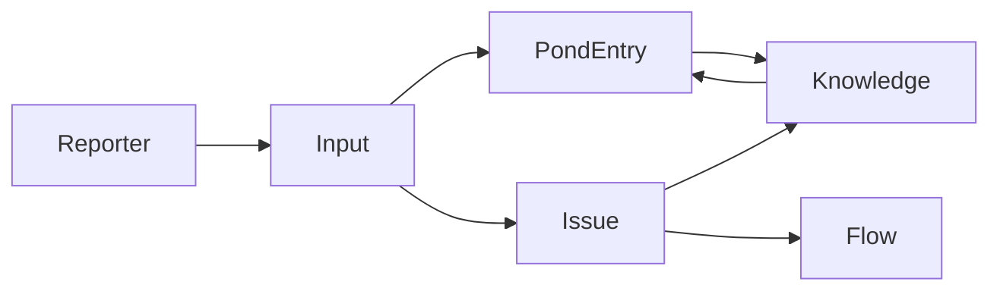

# 情報管理モデル

## 概要

sebas-chanは、情報を段階的に洗練させながら管理するシステムです。生の入力から始まり、課題として整理され、最終的に知識として蒸留されます。

## コアコンセプト

### イベント駆動アーキテクチャ
すべての情報処理はイベント（AgentEvent）を通じて行われます。

```typescript
interface AgentEvent {
  type: string;              // イベントタイプ（INGEST_INPUT等）
  priority: 'high' | 'normal' | 'low';
  payload: unknown;          // イベント固有のデータ
  timestamp: Date;
}
```

## 情報の階層構造

### 1. Input（入力）

Reporterから送られてくる情報の最小単位。

```typescript
interface Input {
  id: string;
  source: string;     // "slack", "gmail", "manual"
  content: string;    // 生のテキストデータ
  timestamp: Date;
}
```

**処理フロー**:
1. Reporterが外部ソースから情報を取得
2. InputとしてシステムにPOST
3. INGEST_INPUTイベントが発火
4. ワークフローでPondへ保存 + Issue作成判定

### 2. Pond（イベントストア）

すべてのイベントとInputが保存されるベクトル化ストア。将来の発見と学習の源泉。

```typescript
interface PondEntry {
  id: string;
  content: string;           // イベントまたはInputの内容
  source: string;           // イベントタイプまたはReporter名（'slack', 'teams', 'email', 'webhook', 'user_request' など）
  context?: string;         // 自然言語的なコンテキスト（例: "work: ECサイト開発", "personal: タスク管理"）
  metadata?: Record<string, unknown>; // 追加のメタデータ（channel、userId、sessionId など）
  timestamp: Date;
  vector?: number[];         // ベクトル化された表現（256次元）
  score?: number;           // 検索時の類似度スコア（0〜1）
  distance?: number;        // 検索時のベクトル距離
}
```

**特徴**:
- **ベクトル検索**: 日本語対応（intfloat/multilingual-e5-small使用）
- **セマンティック検索**: 意味的に類似した情報を発見
- **コンテキスト対応検索**: contextフィールドを含めたベクトル生成で検索精度向上
- **メタデータフィルタリング**: source、context、metadataによる柔軟なフィルタリング
- **サルベージ機能**: 定期的に価値ある情報を発掘
- **完全な履歴**: すべてのイベントとInputを保存

**実装**:
- DB: LanceDB（ベクトルデータベース）
- 埋め込みモデル: ruri-v3（日本語特化）
- 検索API: `/api/pond`エンドポイント

### 3. Issue（課題）

行動可能な管理単位。GitHubのIssueモデルを採用。

```typescript
interface Issue {
  id: string;
  title: string;
  description: string;        // 自然言語での詳細。ベクトル化の対象
  status: 'open' | 'closed';
  priority?: number;          // 優先度（0-100）
  labels: string[];
  updates: IssueUpdate[];      // 履歴
  relations: IssueRelation[];  // 他のIssueとの関係性
  sourceInputIds: string[];
  createdAt: Date;
  updatedAt: Date;
}

interface IssueUpdate {
  timestamp: Date;
  content: string;
  author: 'user' | 'ai';  // ユーザーのメモか、AIの提案か
}

interface IssueRelation {
  type: 'blocks' | 'relates_to' | 'duplicates' | 'parent_of';
  targetIssueId: string;
}
```

**ワークフロー**:
- `PROCESS_USER_REQUEST`: リクエストを分類してIssue作成
- `ANALYZE_ISSUE_IMPACT`: 影響範囲を分析

### 4. Knowledge（知識）

多様な情報源から抽出・蒸留された永続的な知識。評価システムにより信頼性が管理される。

```typescript
interface Knowledge {
  id: string;
  type: KnowledgeType;
  content: string;           // 知識の本体（自然言語）
  reputation: {
    upvotes: number;         // ポジティブ評価の累積
    downvotes: number;       // ネガティブ評価の累積
  };
  sources: KnowledgeSource[]; // この知識を構成する情報源（複数）
}

type KnowledgeType =
  | 'system_rule'         // AIの振る舞いを定義するルール
  | 'process_manual'      // 定型的な業務フローや手順書
  | 'entity_profile'      // 特定の人物、組織、プロジェクトに関する情報
  | 'curated_summary'     // 特定のトピックについて横断的に集められた要約情報
  | 'factoid';            // 再利用可能な単一の事実や情報

type KnowledgeSource =
  | { type: 'issue'; issueId: string }
  | { type: 'pond'; pondEntryId: string }
  | { type: 'user_direct' }
  | { type: 'knowledge'; knowledgeId: string };  // 他のKnowledgeを参照
```

**評価システム**:
- **upvotes**: 有用と判断された回数
- **downvotes**: 不正確・陳腐化と判断された回数
- **信頼度スコア**: `upvotes / (upvotes + downvotes)`で計算可能

**抽出元**:
- Closedになったissueからの学習
- Pondからのパターン発見
- ユーザーによる直接入力
- 他のKnowledgeからの派生

**ワークフロー**:
- `EXTRACT_KNOWLEDGE`: Issueから知識を抽出

### 5. Flow（作業の流れ）

複数のIssueをまとめた、より大きな作業単位。

```typescript
interface Flow {
  id: string;
  title: string;
  description: string;       // このフローの目的や依存関係。自然言語で記述
  status: FlowStatus;
  priorityScore: number;      // 0.0 ~ 1.0 AIが動的に評価
  issueIds: string[];
}

type FlowStatus =
  | 'focused'               // 最優先で集中
  | 'active'                // アクティブ
  | 'monitoring'            // 監視中
  | 'blocked'               // ブロック中
  | 'pending_user_decision' // ユーザー判断待ち
  | 'pending_review'        // レビュー待ち
  | 'backlog'               // バックログ
  | 'paused'                // 一時停止
  | 'someday'               // いつかやる
  | 'completed'             // 完了
  | 'cancelled'             // キャンセル
  | 'archived';             // アーカイブ済み
```

## データフロー



## ストレージアーキテクチャ

```
┌─────────────────────────────────────┐
│         REST API / Web UI           │
└─────────────────────────────────────┘
                 │
┌─────────────────────────────────────┐
│            CoreEngine               │
└─────────────────────────────────────┘
                 │
┌─────────────────────────────────────┐
│         WorkflowContext             │
│  ┌──────────────────────────────┐  │
│  │    WorkflowStorage API       │  │
│  └──────────────────────────────┘  │
└─────────────────────────────────────┘
                 │
┌─────────────────────────────────────┐
│           DB Bridge                 │
│     (TypeScript + Python)           │
└─────────────────────────────────────┘
                 │
┌─────────────────────────────────────┐
│            LanceDB                  │
│   ┌────────────┬────────────┐      │
│   │    Pond    │   Issues   │      │
│   ├────────────┼────────────┤      │
│   │ Knowledge  │   Flows    │      │
│   └────────────┴────────────┘      │
└─────────────────────────────────────┘
```

## 検索とクエリ

### Pond検索
```typescript
interface PondSearchParams {
  q?: string;               // テキスト検索
  source?: string;          // ソースフィルタ
  dateFrom?: Date;          // 開始日
  dateTo?: Date;            // 終了日
  limit?: number;           // 取得件数
  offset?: number;          // オフセット
  vectorSearch?: {
    query: string;          // セマンティック検索クエリ
    topK: number;           // 上位K件
  };
}
```

### Issue/Knowledge検索
```typescript
interface SearchParams {
  query?: string;           // 全文検索
  filters?: {
    status?: string[];
    type?: string[];
    tags?: string[];
  };
  sort?: {
    field: string;
    order: 'asc' | 'desc';
  };
  pagination?: {
    page: number;
    size: number;
  };
}
```

## 実装状況

### 実装済み
- ✅ PondEntry（ベクトル検索対応）
- ✅ Issue CRUD操作
- ✅ Knowledge作成・検索
- ✅ ワークフローによる自動処理
- ✅ REST API（/api/pond, /api/issues, /api/knowledge）
- ✅ Web UI（検索・閲覧機能）

### 未実装
- ⏳ Flow管理機能
- ⏳ Knowledge評価システム
- ⏳ 自動サルベージ機能
- ⏳ Issue関係性の自動検出

---

更新日: 2025-09-19
バージョン: 2.0.0（実装に合わせて大幅更新）