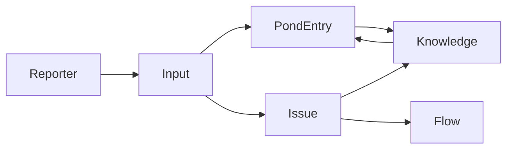

# 情報管理モデル

## 概要

sebas-chanは、情報を段階的に洗練させながら管理するシステムです。生の入力から始まり、課題として整理され、最終的に知識として蒸留されます。

## コアコンセプト

### イベント駆動アーキテクチャ
すべての情報処理はイベント（AgentEvent）を通じて行われます。

```typescript
interface AgentEvent {
  type: string;              // イベントタイプ（INGEST_INPUT等）
  priority: 'high' | 'normal' | 'low';
  payload: unknown;          // イベント固有のデータ
  timestamp: Date;
}
```

## 情報の階層構造

### 1. Input（入力）

Reporterから送られてくる情報の最小単位。

```typescript
interface Input {
  id: string;
  source: string;     // "slack", "gmail", "manual"等
  content: string;    // 生のテキストデータ
  timestamp: Date;
  metadata?: {
    reporter?: string;
    originalFormat?: string;
  };
}
```

**処理フロー**:
1. Reporterが外部ソースから情報を取得
2. InputとしてシステムにPOST
3. INGEST_INPUTイベントが発火
4. ワークフローでPondへ保存 + Issue作成判定

### 2. Pond（イベントストア）

すべてのイベントとInputが保存されるベクトル化ストア。将来の発見と学習の源泉。

```typescript
interface PondEntry {
  id: string;
  content: string;           // イベントまたはInputの内容
  vector?: number[];         // ベクトル化された表現（256次元）
  timestamp: Date;
  source: string;           // イベントタイプまたはReporter名
  score?: number;           // 検索時の類似度スコア（0〜1）
  distance?: number;        // 検索時のベクトル距離
}
```

**特徴**:
- **ベクトル検索**: 日本語対応（intfloat/multilingual-e5-small使用）
- **セマンティック検索**: 意味的に類似した情報を発見
- **サルベージ機能**: 定期的に価値ある情報を発掘
- **完全な履歴**: すべてのイベントとInputを保存

**実装**:
- DB: LanceDB（ベクトルデータベース）
- 埋め込みモデル: ruri-v3（日本語特化）
- 検索API: `/api/pond`エンドポイント

### 3. Issue（課題）

行動可能な管理単位。GitHubのIssueモデルを採用。

```typescript
interface Issue {
  id: string;
  title: string;
  description: string;
  status: 'open' | 'closed';
  priority?: 'high' | 'medium' | 'low';
  labels: string[];
  assignee?: string;
  sourceInputIds: string[];  // 元となったInputのID
  relatedIssueIds?: string[];
  createdAt: Date;
  updatedAt: Date;
  closedAt?: Date;
}
```

**ワークフロー**:
- `PROCESS_USER_REQUEST`: リクエストを分類してIssue作成
- `ANALYZE_ISSUE_IMPACT`: 影響範囲を分析

### 4. Knowledge（知識）

多様な情報源から抽出・蒸留された永続的な知識。

```typescript
interface Knowledge {
  id: string;
  type: KnowledgeType;
  title: string;
  content: string;
  tags: string[];
  sources: {
    type: 'issue' | 'pond' | 'manual' | 'workflow';
    id: string;
  }[];
  confidence: number;     // 0.0〜1.0の信頼度スコア
  createdAt: Date;
  updatedAt: Date;
  usageCount: number;     // 参照回数
}

type KnowledgeType =
  | 'best_practice'      // ベストプラクティス
  | 'troubleshooting'    // トラブルシューティング
  | 'configuration'      // 設定情報
  | 'business_rule'      // ビジネスルール
  | 'technical_spec'     // 技術仕様
  | 'general';           // 一般知識
```

**抽出元**:
- Closedになったissueからの学習
- Pondからのパターン発見
- ユーザーによる直接入力
- ワークフロー実行結果からの蒸留

**ワークフロー**:
- `EXTRACT_KNOWLEDGE`: Issueから知識を抽出

### 5. Flow（作業の流れ）

複数のIssueをまとめた、より大きな作業単位。

```typescript
interface Flow {
  id: string;
  title: string;
  description: string;
  status: FlowStatus;
  priorityScore: number;    // 0.0〜1.0
  issueIds: string[];
  milestones?: {
    title: string;
    dueDate?: Date;
    completed: boolean;
  }[];
  createdAt: Date;
  updatedAt: Date;
}

type FlowStatus =
  | 'active'               // アクティブ
  | 'blocked'              // ブロック中
  | 'pending'              // 保留中
  | 'completed'            // 完了
  | 'archived';            // アーカイブ済み
```

## データフロー



## ストレージアーキテクチャ

```
┌─────────────────────────────────────┐
│         REST API / Web UI           │
└─────────────────────────────────────┘
                 │
┌─────────────────────────────────────┐
│            CoreEngine               │
└─────────────────────────────────────┘
                 │
┌─────────────────────────────────────┐
│         WorkflowContext             │
│  ┌──────────────────────────────┐  │
│  │    WorkflowStorage API       │  │
│  └──────────────────────────────┘  │
└─────────────────────────────────────┘
                 │
┌─────────────────────────────────────┐
│           DB Bridge                 │
│     (TypeScript + Python)           │
└─────────────────────────────────────┘
                 │
┌─────────────────────────────────────┐
│            LanceDB                  │
│   ┌────────────┬────────────┐      │
│   │    Pond    │   Issues   │      │
│   ├────────────┼────────────┤      │
│   │ Knowledge  │   Flows    │      │
│   └────────────┴────────────┘      │
└─────────────────────────────────────┘
```

## 検索とクエリ

### Pond検索
```typescript
interface PondSearchParams {
  q?: string;               // テキスト検索
  source?: string;          // ソースフィルタ
  dateFrom?: Date;          // 開始日
  dateTo?: Date;            // 終了日
  limit?: number;           // 取得件数
  offset?: number;          // オフセット
  vectorSearch?: {
    query: string;          // セマンティック検索クエリ
    topK: number;           // 上位K件
  };
}
```

### Issue/Knowledge検索
```typescript
interface SearchParams {
  query?: string;           // 全文検索
  filters?: {
    status?: string[];
    type?: string[];
    tags?: string[];
  };
  sort?: {
    field: string;
    order: 'asc' | 'desc';
  };
  pagination?: {
    page: number;
    size: number;
  };
}
```

## 実装状況

### 実装済み
- ✅ PondEntry（ベクトル検索対応）
- ✅ Issue CRUD操作
- ✅ Knowledge作成・検索
- ✅ ワークフローによる自動処理
- ✅ REST API（/api/pond, /api/issues, /api/knowledge）
- ✅ Web UI（検索・閲覧機能）

### 未実装
- ⏳ Flow管理機能
- ⏳ Knowledge評価システム
- ⏳ 自動サルベージ機能
- ⏳ Issue関係性の自動検出

---

更新日: 2025-09-19
バージョン: 2.0.0（実装に合わせて大幅更新）