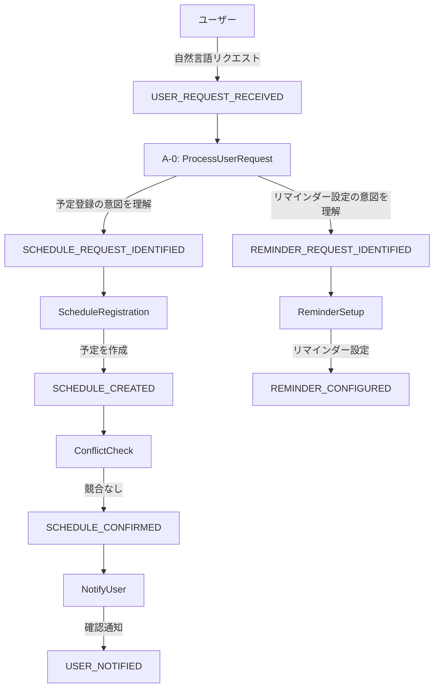
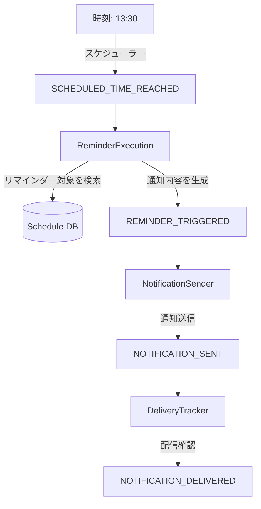

# スケジュール管理ユースケース - イベント駆動設計の検証

## 1. ユースケース概要

「ユーザーが明日の14時にミーティングの予定があることを伝え、システムがリマインドする」というシナリオを通じて、イベント駆動設計を検証します。

## 2. イベントフロー

### シナリオ1: 予定の登録

#### ユーザーリクエスト

```
「明日の14時から山田さんとミーティングがあります。30分前にリマインドしてください」
```

#### イベント連鎖



### 各イベントの詳細

#### USER_REQUEST_RECEIVED

```typescript
{
  type: 'USER_REQUEST_RECEIVED',
  payload: {
    userId: 'user123',
    content: '明日の14時から山田さんとミーティングがあります。30分前にリマインドしてください',
    timestamp: '2024-12-27T10:30:00Z',
    sessionId: 'session456'
  }
}
```

#### SCHEDULE_REQUEST_IDENTIFIED

```typescript
{
  type: 'SCHEDULE_REQUEST_IDENTIFIED',
  payload: {
    userId: 'user123',
    schedule: {
      title: '山田さんとミーティング',
      startTime: '2024-12-28T14:00:00+09:00',
      duration: null,  // 不明
      participants: ['山田さん'],
      location: null    // 不明
    },
    confidence: 0.95
  }
}
```

#### REMINDER_REQUEST_IDENTIFIED

```typescript
{
  type: 'REMINDER_REQUEST_IDENTIFIED',
  payload: {
    userId: 'user123',
    reminder: {
      targetEvent: '山田さんとミーティング',
      leadTime: 30,  // 分
      method: 'notification'  // デフォルト
    }
  }
}
```

### シナリオ2: リマインダーの実行

#### 時刻到達によるトリガー



## 3. ワークフローとトリガーイベント

### A-0: ProcessUserRequest

**いつ動くか**: `USER_REQUEST_RECEIVED`イベント発生時
**役割**: 自然言語を解釈し、システムが理解できるイベントに変換

### ScheduleRegistration

**いつ動くか**: `SCHEDULE_REQUEST_IDENTIFIED`イベント発生時
**何を得るか**:

- スケジュール情報（タイトル、時刻、参加者等）
- ユーザーコンテキスト

**何をするか**:

1. 不足情報の推測・補完
2. タイムゾーン変換
3. スケジュールエントリーの作成
4. データベースへの保存

**何を出すか**:

- `SCHEDULE_CREATED`: 正常に作成された
- `SCHEDULE_VALIDATION_FAILED`: 検証エラー
- `CLARIFICATION_NEEDED`: 情報不足

### ReminderSetup

**いつ動くか**: `REMINDER_REQUEST_IDENTIFIED`イベント発生時
**何を得るか**:

- リマインダー設定（リードタイム、通知方法）
- 対象スケジュール

**何をするか**:

1. リマインダー時刻の計算
2. 通知方法の決定
3. スケジューラーへの登録

**何を出すか**:

- `REMINDER_CONFIGURED`: 設定完了
- `REMINDER_SETUP_FAILED`: 設定失敗

### ConflictCheck

**いつ動くか**: `SCHEDULE_CREATED`イベント発生時
**何を得るか**:

- 新規スケジュール情報
- 既存スケジュール一覧

**何をするか**:

1. 時間的重複の検出
2. リソース競合の確認
3. 優先度判定

**何を出すか**:

- `SCHEDULE_CONFIRMED`: 競合なし
- `SCHEDULE_CONFLICT_DETECTED`: 競合あり
- `SCHEDULE_ADJUSTMENT_SUGGESTED`: 調整案あり

### ReminderExecution

**いつ動くか**: `SCHEDULED_TIME_REACHED`イベント発生時
**何を得るか**:

- トリガー時刻
- リマインダー設定

**何をするか**:

1. 該当リマインダーの検索
2. 通知内容の生成
3. ユーザー状態の確認

**何を出すか**:

- `REMINDER_TRIGGERED`: リマインダー実行
- `REMINDER_SKIPPED`: スキップ（条件不適合）
- `REMINDER_POSTPONED`: 延期

## 4. イベント駆動設計の利点

### 1. 柔軟性

- ユーザーリクエストから複数の独立したイベントを生成
- 各ワークフローが独立して動作

### 2. 拡張性

- 新しい機能（例：場所の提案）を新しいワークフローとして追加可能
- 既存ワークフローに影響なし

### 3. 信頼性

- 各ステップが独立してリトライ可能
- 部分的な失敗に対応

### 4. 監査性

- すべてのイベントが記録される
- 処理の流れが追跡可能

## 5. 実装に必要なワークフロー

### 既存A系列で対応可能な部分

- **A-0**: ユーザーリクエストの解釈 ✓
- **A-1**: スケジュールデータの取り込み（部分的）
- **A-3**: スケジュールパターンの知識化

### 新規に必要なワークフロー

1. **S-1: ScheduleRegistration** - スケジュール登録
2. **S-2: ReminderSetup** - リマインダー設定
3. **S-3: ConflictCheck** - 競合チェック
4. **S-4: ReminderExecution** - リマインダー実行
5. **S-5: ScheduleUpdate** - スケジュール更新
6. **S-6: ScheduleCancel** - スケジュール取消

## 6. トリガーイベント一覧

### 外部トリガー

| イベント                 | 説明                     | トリガーされるワークフロー    |
| ------------------------ | ------------------------ | ----------------------------- |
| `USER_REQUEST_RECEIVED`  | ユーザーからのリクエスト | A-0                           |
| `SCHEDULED_TIME_REACHED` | スケジュール時刻到達     | ReminderExecution, 定期タスク |
| `EXTERNAL_DATA_ARRIVED`  | 外部データ到着           | A-1                           |

### 内部トリガー

| イベント                      | 説明                   | トリガーされるワークフロー |
| ----------------------------- | ---------------------- | -------------------------- |
| `SCHEDULE_REQUEST_IDENTIFIED` | スケジュール要求を識別 | S-1: ScheduleRegistration  |
| `REMINDER_REQUEST_IDENTIFIED` | リマインダー要求を識別 | S-2: ReminderSetup         |
| `SCHEDULE_CREATED`            | スケジュール作成完了   | S-3: ConflictCheck         |
| `ERROR_DETECTED`              | エラー検出             | A-2: AnalyzeIssueImpact    |
| `KNOWLEDGE_EXTRACTABLE`       | 知識抽出可能           | A-3: ExtractKnowledge      |

## 7. 考察

### ユーザーリクエストの特殊性が明確に

- 「明日の14時」→ 具体的な日時への変換が必要
- 「山田さん」→ 実際のユーザーIDやメールアドレスへの解決が必要
- 1つのリクエストから2つの独立したイベント（スケジュール登録とリマインダー設定）

### イベントの事実性

- `SCHEDULE_CREATED`は「作成された」という事実
- `REMINDER_TRIGGERED`は「トリガーされた」という事実
- 処理指示ではなく、起きたことの記録

### ワークフローの独立性

- 各ワークフローは特定のイベントに反応
- 他のワークフローの実装を知る必要がない
- 疎結合で保守性が高い

## 8. まとめ

スケジュール管理のユースケースを通じて、イベント駆動設計の有効性が確認できました：

1. **明確な責任分離**: 各ワークフローが単一の責任を持つ
2. **イベントの連鎖**: 複雑な処理を単純なステップの連鎖として表現
3. **柔軟な拡張**: 新機能を新しいワークフローとして追加可能
4. **エラー処理**: 各ステップで独立してエラー処理可能

この設計をA系列ワークフローの改善に適用することで、より堅牢で拡張可能なシステムが実現できます。
