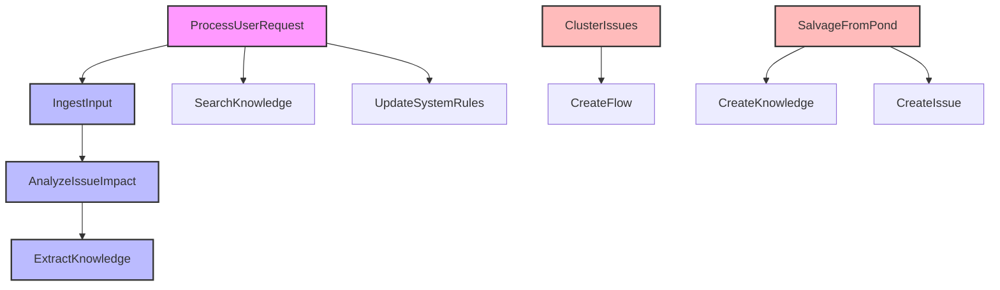

# ワークフロー詳細設計書

## 1. 概要

本文書は、sebas-chanシステムで実装されているワークフローおよび計画されているワークフローの詳細仕様を定義します。各ワークフローのInput/Output/Process仕様を明確化し、全体としての機能の過不足を検討することを目的とします。

## 2. ワークフローアーキテクチャ

### 2.1 基本設計

- **関数ベース**: 各ワークフローは状態を持たない純粋関数として実装
- **イベント駆動**: AgentEventによってトリガーされる
- **優先度制御**: 実行順序を優先度で制御（-100〜100）
- **型安全**: TypeScriptの型システムで完全に型付け

### 2.2 共通インターフェース

```typescript
interface WorkflowDefinition {
  name: string; // ワークフロー識別子
  description: string; // ワークフローの説明
  triggers: {
    eventTypes: string[]; // トリガーイベント
    priority?: number; // 実行優先度
  };
  executor: WorkflowExecutor; // 実行関数
}
```

## 3. 実装済みワークフロー

### A-0: ProcessUserRequest

**目的**: ユーザーリクエストを分類し、適切な後続ワークフローへルーティング

**仕様**:
| 項目 | 内容 |
|------|------|
| **トリガーイベント** | `PROCESS_USER_REQUEST` |
| **優先度** | 60（高優先度） |
| **実装状態** | 実装済み |

**Input**:

```typescript
interface Input {
  request: {
    id: string;
    content: string;
    userId?: string;
    timestamp: Date;
  };
}
```

**Process**:

1. AIを使用してリクエストを分析
2. リクエストタイプを分類（issue/question/feedback）
3. 分類に基づいて後続イベントを決定
4. 後続イベントを発行

**Output**:

```typescript
interface Output {
  requestType: 'issue' | 'question' | 'feedback';
  aiResponse: string;
}
```

**後続イベント（emitter.emit()で発行）**:

- `ANALYZE_ISSUE_IMPACT`: issue（追跡事項）の場合
  - payload: `{ issue: request, aiResponse: string }`
- `EXTRACT_KNOWLEDGE`: question（質問）の場合
  - payload: `{ question: request.content, context: aiResponse }`
- `EXTRACT_KNOWLEDGE`: feedback（フィードバック）の場合
  - payload: `{ feedback: request.content, source: 'user_feedback' }`

---

### A-1: IngestInput

**目的**: 入力データをPondに取り込み、追跡すべき事項を検出して必要に応じて分析を起動

**仕様**:
| 項目 | 内容 |
|------|------|
| **トリガーイベント** | `INGEST_INPUT` |
| **優先度** | 40（標準優先度） |
| **実装状態** | 実装済み |

**Input**:

```typescript
interface Input {
  input: {
    source: string;
    content: string;
    metadata?: Record<string, unknown>;
  };
}
```

**Process**:

1. 入力データをPondに保存
2. 追跡すべき事項の検出（期限、重要度、繰り返しパターン等）
3. 追跡が必要と判断された場合、Issue作成
4. 影響分析イベントを発行

**Output**:

```typescript
interface Output {
  pondEntryId: string;
  containsError: boolean;
  issueId?: string; // 追跡事項検出時のみ
}
```

**後続イベント（emitter.emit()で発行）**:

- `ANALYZE_ISSUE_IMPACT`: 追跡事項検出時
  - payload: `{ issue: { id, content, description, inputId }, pondEntryId: string }`

---

### A-2: AnalyzeIssueImpact

**目的**: Issueの影響範囲を分析し、関連性と優先度を判定

**仕様**:
| 項目 | 内容 |
|------|------|
| **トリガーイベント** | `ANALYZE_ISSUE_IMPACT` |
| **優先度** | 30（バックグラウンド分析） |
| **実装状態** | 実装済み |

**Input**:

```typescript
interface Input {
  issueId: string;
}
```

**Process**:

1. IssueをDBから取得
2. 関連するPondエントリを検索
3. AIで影響範囲と重要度を分析
4. 影響度スコアを計算（0-100）
5. 高影響度の場合、知識抽出を起動

**Output**:

```typescript
interface Output {
  impactScore: number;
  affectedComponents: string[];
  relatedIssues: string[];
  recommendation: string;
}
```

**後続イベント（emitter.emit()で発行）**:

- `EXTRACT_KNOWLEDGE`: 影響度スコア > 80の場合
  - payload: `{ issueId: string, impactAnalysis: string, source: 'high_impact_issue' }`

---

### A-3: ExtractKnowledge

**目的**: 情報から再利用可能な知識を抽出し、Knowledge DBに保存

**仕様**:
| 項目 | 内容 |
|------|------|
| **トリガーイベント** | `EXTRACT_KNOWLEDGE` |
| **優先度** | 20（バックグラウンド処理） |
| **実装状態** | 実装済み |

**Input**:

```typescript
interface Input {
  sourceId: string; // IssueまたはPondエントリのID
  sourceType: 'issue' | 'pond';
}
```

**Process**:

1. ソースデータを取得
2. AIで知識を抽出・構造化
3. カテゴリーとタグを自動生成
4. Knowledge DBに保存
5. 関連Issueとのリンクを作成

**Output**:

```typescript
interface Output {
  knowledgeId: string;
  title: string;
  category: string;
  tags: string[];
  content: string;
}
```

**後続イベント（emitter.emit()で発行）**: なし（終端ワークフロー）

## 4. 計画中のワークフロー

### B-1: ClusterIssues

**目的**: 類似したIssueをクラスタリングし、新たなFlowの生成を提案

**仕様**:
| 項目 | 内容 |
|------|------|
| **トリガーイベント** | `CLUSTER_ISSUES` |
| **優先度** | 10（低優先度） |
| **実装状態** | 未実装 |

**Input**:

```typescript
interface Input {
  timeRange?: {
    start: Date;
    end: Date;
  };
  minClusterSize?: number; // デフォルト: 3
}
```

**Process**:

1. 指定期間内の全Issueを取得
2. ベクトル埋め込みで類似度計算
3. クラスタリングアルゴリズムを適用
4. 各クラスターの共通パターンを抽出
5. Flow提案を生成

**Output**:

```typescript
interface Output {
  clusters: Array<{
    issueIds: string[];
    commonPattern: string;
    suggestedFlowName: string;
    confidence: number;
  }>;
}
```

**後続イベント**:

- `CREATE_FLOW`: 高信頼度クラスターの場合

---

### B-2: UpdateFlowRelations

**目的**: FlowとIssueの関係性を維持・更新

**仕様**:
| 項目 | 内容 |
|------|------|
| **トリガーイベント** | `UPDATE_FLOW_RELATIONS` |
| **優先度** | 15 |
| **実装状態** | 未実装 |

**Input**:

```typescript
interface Input {
  flowId?: string; // 特定のFlowのみ更新する場合
}
```

**Process**:

1. 対象Flowを取得
2. Flowのdescriptionを解析
3. 関連Issueを検索・マッチング
4. 依存関係グラフを構築
5. DBの関係性を更新

**Output**:

```typescript
interface Output {
  updatedFlows: number;
  newRelations: number;
  removedRelations: number;
}
```

---

### B-3: UpdateFlowPriorities

**目的**: 動的な優先度調整

**仕様**:
| 項目 | 内容 |
|------|------|
| **トリガーイベント** | `UPDATE_FLOW_PRIORITIES` |
| **優先度** | 15 |
| **実装状態** | 未実装 |

**Input**:

```typescript
interface Input {
  factors?: {
    userActivity?: boolean;
    issueUrgency?: boolean;
    systemLoad?: boolean;
  };
}
```

**Process**:

1. 全Flowの現在状態を取得
2. 各要因のスコアを計算
3. 重み付け合計で最終スコアを決定
4. 優先度を更新

**Output**:

```typescript
interface Output {
  updatedFlows: Array<{
    flowId: string;
    oldPriority: number;
    newPriority: number;
    reason: string;
  }>;
}
```

---

### B-4: SalvageFromPond

**目的**: 未整理情報から価値あるデータを発見

**仕様**:
| 項目 | 内容 |
|------|------|
| **トリガーイベント** | `SALVAGE_FROM_POND` |
| **優先度** | 5（最低優先度） |
| **実装状態** | 未実装 |

**Input**:

```typescript
interface Input {
  searchPatterns?: string[];
  maxAge?: number; // 日数
}
```

**Process**:

1. Pondから未処理エントリを取得
2. パターンマッチングとクラスタリング
3. 価値判定アルゴリズムを適用
4. 発見された情報を分類

**Output**:

```typescript
interface Output {
  discoveries: Array<{
    pondEntryIds: string[];
    type: 'knowledge' | 'issue' | 'noise';
    value: string;
    confidence: number;
  }>;
}
```

**後続イベント**:

- `CREATE_KNOWLEDGE`: knowledge typeの場合
- `CREATE_ISSUE`: issue typeの場合

---

### C-1: SuggestNextFlow

**目的**: ユーザーの次のアクションを提案

**仕様**:
| 項目 | 内容 |
|------|------|
| **トリガーイベント** | `SUGGEST_NEXT_FLOW` |
| **優先度** | 25 |
| **実装状態** | 未実装 |

**Input**:

```typescript
interface Input {
  userId: string;
  context?: string; // 現在の作業コンテキスト
}
```

**Process**:

1. ユーザーの作業履歴を分析
2. 未完了Flowの優先度を取得
3. コンテキストマッチング
4. 推奨Flowリストを生成

**Output**:

```typescript
interface Output {
  suggestions: Array<{
    flowId: string;
    flowName: string;
    reason: string;
    priority: number;
    estimatedTime: number; // 分
  }>;
}
```

---

### C-2: SuggestNextAction

**目的**: Issue対応の具体的アクション提案

**仕様**:
| 項目 | 内容 |
|------|------|
| **トリガーイベント** | `SUGGEST_NEXT_ACTION` |
| **優先度** | 25 |
| **実装状態** | 未実装 |

**Input**:

```typescript
interface Input {
  issueId: string;
}
```

**Process**:

1. Issue詳細と履歴を取得
2. 類似Issue の解決パターンを検索
3. Knowledge DBから関連情報を取得
4. AIで具体的アクションを生成

**Output**:

```typescript
interface Output {
  actions: Array<{
    description: string;
    type: 'investigate' | 'fix' | 'escalate' | 'close';
    confidence: number;
    references: string[]; // 参考Knowledge/Issue ID
  }>;
}
```

## 5. ワークフロー連携マトリクス

### イベントフロー



### 優先度レベル

| レベル | 範囲   | ワークフロー                               | 用途                   |
| ------ | ------ | ------------------------------------------ | ---------------------- |
| 高     | 50-100 | A-0 (60)                                   | ユーザー応答、緊急処理 |
| 標準   | 20-49  | A-1 (40), A-2 (30), C-1/C-2 (25), A-3 (20) | 通常業務処理           |
| 低     | 0-19   | B-2/B-3 (15), B-1 (10), B-4 (5)            | バックグラウンド処理   |

## 6. データフロー分析

### 入力ソース

1. **ユーザーリクエスト**: Web UI、API経由
2. **Reporters**: 外部システムからの自動収集
3. **内部イベント**: ワークフローチェーン
4. **スケジュール**: 定期実行（将来実装）

### データストア

1. **Pond**: 生データの永続化、ベクトル検索
2. **Issue DB**: 構造化された追跡事項管理
3. **Knowledge DB**: 再利用可能な知識
4. **Flow DB**: ワークフロー状態管理

### 出力先

1. **ユーザー通知**: 提案、アラート
2. **後続ワークフロー**: イベント発行
3. **外部システム**: API、Webhook（将来実装）

## 7. 機能の過不足分析

### 充足している機能

✅ 基本的なデータ取り込み（A-1）
✅ エラー検出と影響分析（A-2）
✅ 知識抽出（A-3）
✅ ユーザーリクエスト処理（A-0）

### 不足している機能

❌ Flow管理系（B-1, B-2, B-3）
❌ 提案系（C-1, C-2）
❌ 自動クリーンアップ（B-4）
❌ システム自己調整（D系）
❌ 定期実行スケジューラー

### 改善が必要な機能

⚠️ Moduler Prompt統合の完全化
⚠️ エラーハンドリングの強化
⚠️ テストカバレッジの向上
⚠️ パフォーマンス最適化

## 8. 実装優先順位

### Phase 1（即座に実施）

1. 既存ワークフローのModuler Prompt統合
2. WorkflowTriggerのcondition機能実装
3. 基本的なテスト整備

### Phase 2（基本機能確立後）

1. B-1: ClusterIssues実装
2. C-1/C-2: 提案系ワークフロー実装
3. 統合テスト環境構築

### Phase 3（拡張機能）

1. B-2/B-3: Flow管理系実装
2. B-4: Pondサルベージ実装
3. D系: システム自己調整機能
4. スケジュール実行機能

## 9. リスクと対策

| リスク                     | 影響度 | 対策                               |
| -------------------------- | ------ | ---------------------------------- |
| ワークフロー間の無限ループ | 高     | イベント履歴追跡、最大実行回数制限 |
| パフォーマンス劣化         | 中     | 優先度制御、同時実行数制限         |
| データ不整合               | 高     | トランザクション管理、状態検証     |
| AI処理コスト               | 中     | キャッシュ、バッチ処理             |

## 10. 成功指標

1. **機能完全性**: 全計画ワークフローの実装完了
2. **信頼性**: エラー率 < 1%
3. **パフォーマンス**: 平均実行時間 < 5秒
4. **テスト**: カバレッジ > 80%
5. **拡張性**: 新規ワークフロー追加時間 < 2時間

## 11. まとめ

現在、基本的なワークフロー（A系）は実装済みですが、以下の課題があります：

1. **技術的負債**: Moduler Prompt統合が不完全
2. **機能不足**: Flow管理、提案系、自動化機能が未実装
3. **品質**: テストカバレッジが不十分

これらの課題を段階的に解決し、完全な思考エンジンシステムを構築していく必要があります。
