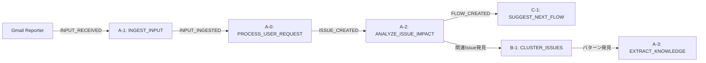
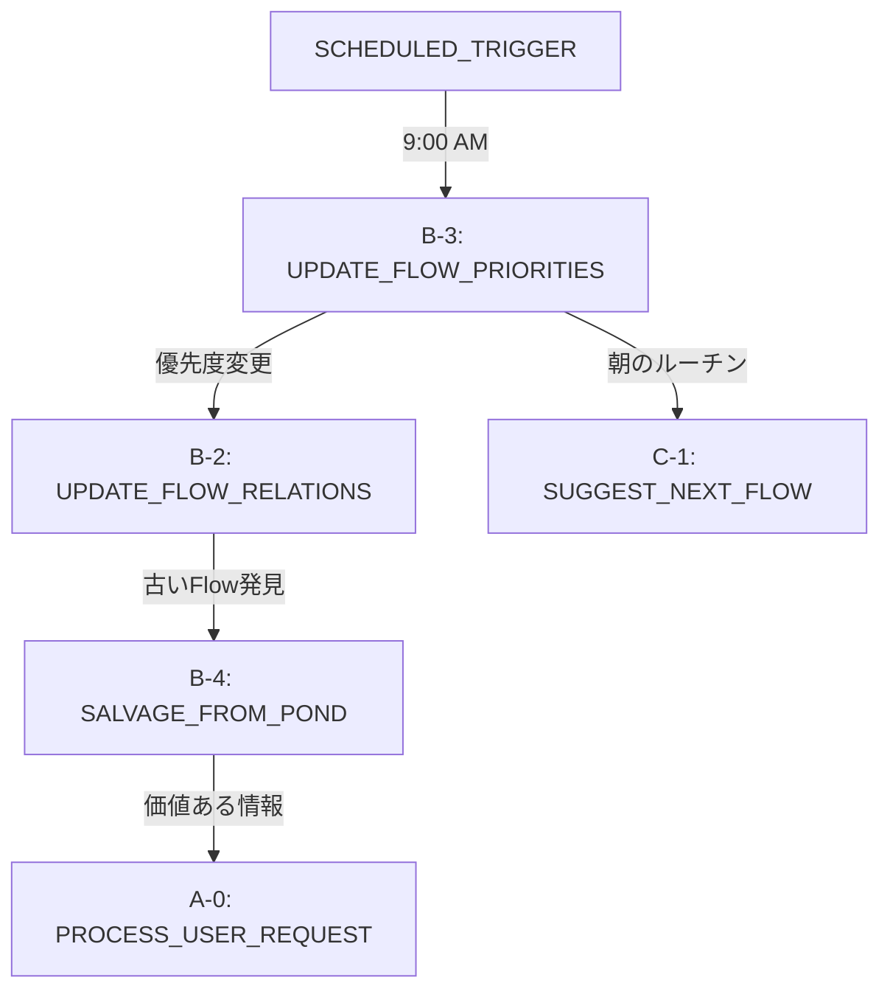
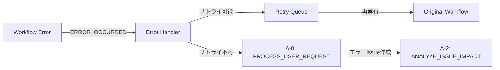
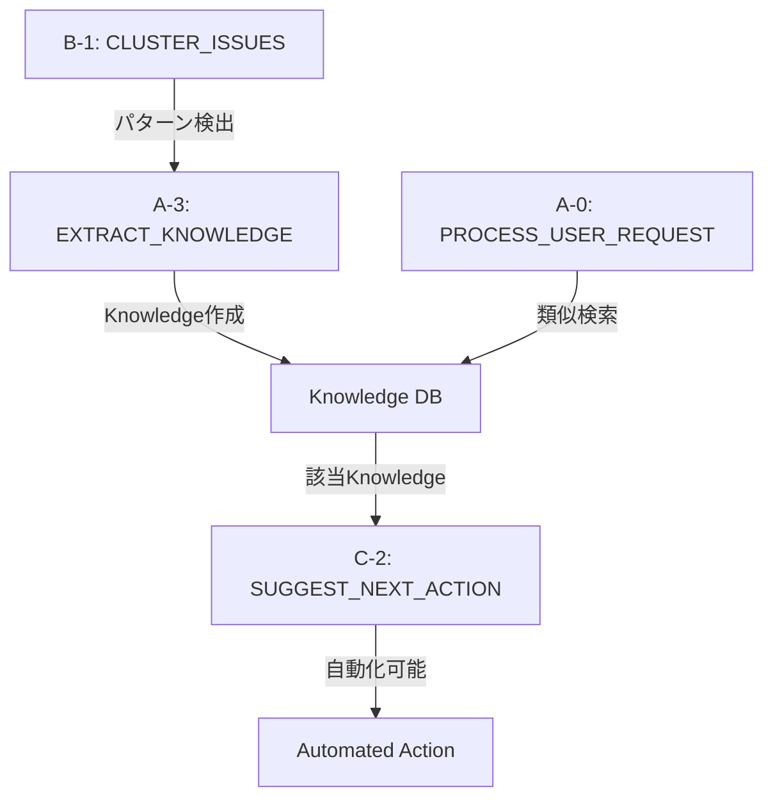

# ワークフロー連携シナリオ

## 概要

このドキュメントでは、複数のワークフローがどのように連携して複雑なタスクを処理するかを示します。イベント駆動アーキテクチャにおける実際の動作フローを検証します。

## シナリオ1: メール受信から行動計画まで

### トリガー
Gmailから重要なメールを受信

### ワークフローチェーン



### 詳細フロー

#### Step 1: メール受信（Reporter → A-1）
```typescript
// Gmail Reporterからの入力
{
  type: 'INPUT_RECEIVED',
  payload: {
    source: 'gmail',
    content: '件名: 予算承認について\n本文: 明日までに予算申請書の修正が必要です...',
    metadata: {
      sender: 'manager@example.com',
      timestamp: '2024-01-20T10:00:00Z',
      importance: 'high'
    }
  }
}

// A-1の処理結果
{
  pondEntry: { id: 'pond-001', vectorized: true },
  createdIssue: {
    id: 'issue-001',
    title: '予算申請書の修正',
    priority: 'high',
    deadline: '2024-01-21'
  }
}
```

#### Step 2: Issue影響分析（A-2）
```typescript
// イベントチェーン
ISSUE_CREATED → A-2実行

// A-2の処理
- Pondから「予算」関連の過去データを検索
- 関連Issue: 先月の予算申請、テンプレート
- Flow作成: 「予算申請修正フロー」
```

#### Step 3: 並列処理（B-1 & C-1）
```typescript
// 同時に2つのワークフローが起動
// B-1: 関連Issueのクラスタリング
{
  clusters: [{
    theme: '予算関連タスク',
    issueIds: ['issue-001', 'issue-past-01', 'issue-past-02'],
    commonPatterns: ['締切厳守', 'テンプレート使用']
  }]
}

// C-1: 次のFlow提案
{
  suggestions: [{
    flowId: 'flow-budget',
    reason: '締切が明日で最優先',
    estimatedDuration: 120
  }]
}
```

## シナリオ2: 定期実行による最適化

### トリガー
毎朝9時の定期実行

### ワークフローチェーン



### 実行順序（優先度順）

1. **B-3: UPDATE_FLOW_PRIORITIES**（優先度: 15）
   - すべてのFlowの優先度を再計算
   - 締切、進捗、コンテキストを考慮

2. **B-2: UPDATE_FLOW_RELATIONS**（優先度: 15）
   - Flow間の関係を更新
   - 完了したIssueの除外
   - 新規Issueの追加

3. **C-1: SUGGEST_NEXT_FLOW**（優先度: 25）
   - 朝のルーチンとして最適なFlowを提案
   - ユーザーの過去の行動パターンを考慮

4. **B-4: SALVAGE_FROM_POND**（優先度: 5）
   - バックグラウンドで古い情報を分析
   - 価値が見つかれば新規Issueを作成

## シナリオ3: エラー回復とリトライ

### トリガー
ワークフロー実行エラー

### ワークフローチェーン



### エラーハンドリングパターン

#### パターン1: 一時的エラー（ネットワーク等）
```typescript
// WorkflowExecutorのリトライ機構
{
  error: 'NetworkTimeout',
  retryable: true,
  retryCount: 1,
  maxRetries: 3,
  backoffMs: 1000
}
// → 自動リトライ
```

#### パターン2: 永続的エラー（データ不整合等）
```typescript
// エラーからIssueを生成
{
  type: 'WORKFLOW_ERROR',
  payload: {
    workflowName: 'analyze-issue-impact',
    error: 'Invalid Issue reference',
    context: { issueId: 'non-existent' }
  }
}
// → A-0がエラーIssueを作成 → 人間の介入を促す
```

## シナリオ4: Knowledge活用による自動化

### トリガー
類似パターンの検出

### ワークフローチェーン



### Knowledge活用フロー

#### Step 1: パターン学習
```typescript
// B-1が繰り返しパターンを検出
{
  pattern: '毎週月曜の報告書作成',
  frequency: 'weekly',
  confidence: 0.95
}

// A-3がKnowledgeとして保存
{
  type: 'procedure',
  content: '週次報告書作成手順',
  template: { ... },
  automatable: true
}
```

#### Step 2: 自動提案
```typescript
// 月曜日にA-0が起動
// Knowledgeから手順を取得
// C-2が具体的なアクションを生成
{
  actions: [{
    type: 'automated',
    description: '週次報告書の自動生成',
    template: 'weekly-report-template',
    confidence: 0.95
  }]
}
```

## シナリオ5: 優先度による競合解決

### 状況
複数の高優先度イベントが同時発生

### ワークフローの実行順序

```typescript
// 同時に発生したイベント
[
  { type: 'URGENT_USER_REQUEST', priority: 80 },
  { type: 'SYSTEM_ALERT', priority: 90 },
  { type: 'SCHEDULED_TASK', priority: 20 },
  { type: 'BACKGROUND_ANALYSIS', priority: 5 }
]

// WorkflowResolverの処理順序
1. SYSTEM_ALERT       → 即座に実行（優先度: 90）
2. URGENT_USER_REQUEST → 次に実行（優先度: 80）
3. SCHEDULED_TASK     → キューで待機（優先度: 20）
4. BACKGROUND_ANALYSIS → 最後に実行（優先度: 5）
```

### キューイングと並列実行

```typescript
// WorkflowQueueの状態
{
  executing: [
    { workflow: 'handle-system-alert', priority: 90 }
  ],
  queued: [
    { workflow: 'process-urgent-request', priority: 80 },
    { workflow: 'scheduled-task', priority: 20 },
    { workflow: 'background-analysis', priority: 5 }
  ],
  maxConcurrent: 3  // 最大3つまで並列実行可能
}
```

## 検証結果

### 強み ✅

1. **イベント駆動の柔軟性**
   - 各ワークフローが独立して動作
   - 疎結合による保守性

2. **優先度管理**
   - 重要なタスクを確実に優先
   - システム負荷の適切な管理

3. **エラー耐性**
   - 個別のエラーが全体に波及しない
   - 適切なリトライとフォールバック

4. **学習と改善**
   - Knowledgeによる継続的な改善
   - パターン認識による自動化

### 改善点 ⚠️

1. **デッドロック防止**
   - 循環依存の検出機構が必要
   - タイムアウト設定の最適化

2. **リソース管理**
   - 並列実行数の動的調整
   - メモリ使用量の監視

3. **トレーサビリティ**
   - イベントチェーンの可視化
   - デバッグ用のログ強化

## まとめ

ワークフローの連携設計は、複雑なシナリオに対して適切に機能することが確認できました。イベント駆動アーキテクチャにより、柔軟で拡張可能なシステムが実現されています。

次のステップとして、これらのシナリオを実装時のテストケースとして活用し、実際の動作を検証していきます。