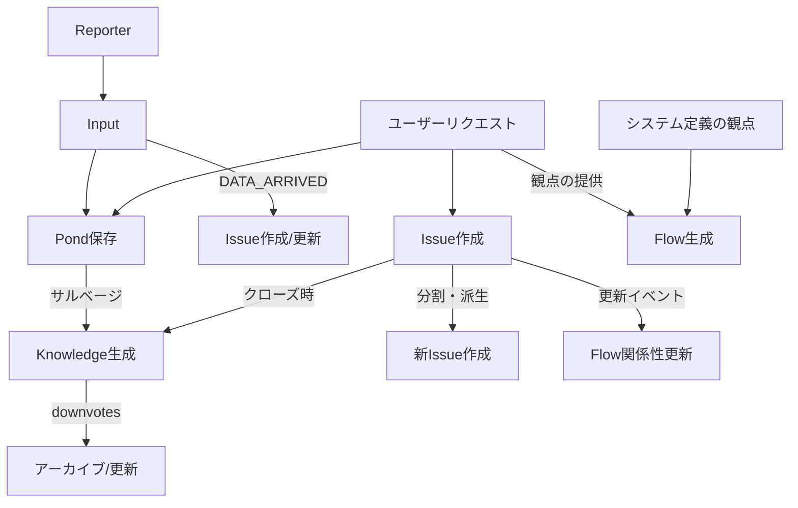

# 情報モデル間の相互作用設計 v2

## 1. 現在の定義整理（コメント反映版）

### 1.1 各モデルの役割（明確化版）

#### Input
- **役割**: 外部からの情報入力の処理単位
- **特徴**:
  - Reporterから送られてくる情報の最小単位
  - Pondに保存されると同時に`DATA_ARRIVED`イベントが発生
  - 基本的にはInput到着時に即座にIssue化を検討
- **処理フロー**:
  1. Reporter/ユーザーから Input 到着
  2. Pond に自動保存
  3. `DATA_ARRIVED` イベント発行
  4. ワークフローによりIssue作成/更新を判定

#### PondEntry
- **役割**: 外部から与えられたすべての情報の不変ストア
- **特徴**:
  - Inputデータとユーザーリクエストを保存
  - ベクトル検索による意味的類似度検索
  - サルベージによる価値ある情報の発掘
- **データソース**:
  - Input（Reporter経由の外部データ）
  - ユーザーリクエスト
- **変換先**:
  - Issueへ（Input到着時の自動処理）
  - Knowledgeへ（サルベージ経由）

#### Issue
- **役割**: ユーザーに代わってAIが追跡・管理すべき事項
- **特徴**:
  - 粒度に幅がある（時間軸、情報量ともに多様）
  - FlowなしでIssueだけで存在可能
  - 状態管理（open/closed）
  - 関係性管理（blocks, relates_to, duplicates, parent_of）
  - 既存Issueから新Issueの派生が可能（分割、関連事項の切り出し）
- **生成元**:
  - Input到着時の自動生成/更新
  - ユーザー明示的要求
  - 既存Issueからの分割・派生
- **終了条件**:
  - 起票時に終了条件を設定することを検討
  - 生成AIが判断（プロンプトベース）

#### Flow
- **役割**: 「観点」を持ち、関連Issueに位置づけを与える
- **特徴**:
  - Issueを「まとめる」のではなく「位置づける」
  - 観点に基づいて集められたIssueの関係性を自然言語で定義
  - AIによる動的な優先度評価（0.0～1.0）
- **生成トリガー**:
  - ユーザーが「観点」を提供したとき
  - システムが定義した観点（「今週の作業」「今日のタスク」「スタックしている作業」等）
  - 最初はユーザーリクエストベースで実装

#### Knowledge
- **役割**: 多様な情報源から抽出・蒸留された永続的な知識
- **特徴**:
  - 5種類の知識タイプ
  - 評価システム（upvotes/downvotes）
  - 新規作成のみ（抽出されたKnowledgeは「純度が高い」）
- **更新戦略**:
  - 能動的更新: 内容が古くなった時にイベント発生→更新試行
  - 受動的更新: 新規Knowledge生成時に既存のものとマージ検討
- **品質管理**:
  - downvotesが閾値以下→更新かアーカイブを決定
  - upvotesは検索順位に影響
  - `KNOWLEDGE_CORRUPTED`イベントの発行を検討

## 2. 明確化された設計方針

### 2.1 データフローの明確化



### 2.2 相互作用の原則

#### 単方向の関係
- Input → Pond（自動保存）
- Input → Issue（DATA_ARRIVEDイベント経由で作成/更新）
- Pond → Knowledge（サルベージ）
- Issue → Knowledge（クローズ時の学習）
- Issue → Issue（分割・派生による新Issue作成）
- Knowledge → アーカイブ（品質劣化時）

#### 影響関係
- Issue更新 → Flow関係性の再計算（IssueそのものはFlowに触られない）
- Knowledge生成 → 既存Knowledgeとのマージ検討

#### 生成されない関係
- Knowledge → Issue（Knowledgeから新Issueは生まれない）
- Knowledge → Pond（Knowledgeは Pondに戻らない）
- Flow → Issue（FlowがIssueを直接変更することはない）

### 2.3 Flowの「観点」システム

#### システム定義の観点（例）
```typescript
type SystemPerspective = {
  "daily_tasks": {
    title: "今日のタスク",
    criteria: "due_date = today OR priority > 80",
    refresh: "daily"
  },
  "weekly_work": {
    title: "今週の作業",
    criteria: "due_date within 7 days",
    refresh: "weekly"
  },
  "stuck_items": {
    title: "スタックしている作業",
    criteria: "status = blocked OR (updated_at < 7 days ago AND status = open)",
    refresh: "daily"
  }
}
```

#### ユーザー定義の観点
```typescript
interface UserPerspective {
  title: string;           // "プロジェクトX関連"
  description: string;     // 観点の説明
  query?: string;         // Issue収集クエリ
  relationships?: string; // Issue間の関係性の記述（自然言語）
  completionCriteria?: string; // 完了条件
}
```

## 3. ライフサイクル管理

### 3.1 Issue のライフサイクル

```
作成:
  - Input到着時の自動作成（DATA_ARRIVEDイベント）
  - ユーザー明示的要求
  - 既存Issueからの分割・派生
  - 起票時に終了条件を設定（プロンプトで指示）

更新:
  - Input到着時の自動更新（関連Input検出時）
  - ユーザー操作
  - ワークフローによる自動更新
  - Flow再計算のトリガー

分割・派生:
  - 意味が異なる場合に分離
  - サブタスクの切り出し
  - 関連事項の別Issue化

クローズ:
  - 生成AIが終了条件を判断
  - ユーザー明示的クローズ
  - Knowledge抽出のトリガー

再オープン:
  - ユーザー指示のみ
```

### 3.2 Flow のライフサイクル

```
生成:
  - ユーザーが観点を提供
  - システム定義の観点が発動
  - 完了条件を同時に定義

更新:
  - 関連Issueの状態変化
  - 観点の再評価
  - 関係性記述の更新（自然言語）

完了:
  - 完了条件を満たす（例: 全関連Issueのクローズ）
  - ユーザー明示的完了

アーカイブ:
  - 完了後一定期間経過
```

### 3.3 Knowledge のライフサイクル

```
生成:
  - Issueクローズ時の抽出
  - Pondからのサルベージ
  - 新規作成のみ（純度重視）

評価:
  - upvotes: 検索順位向上
  - downvotes: 品質劣化の指標

更新/アーカイブ:
  - downvotesが閾値以下
  - KNOWLEDGE_CORRUPTED イベント
  - 最終更新時間による陳腐化検出

矛盾処理:
  - Issueを立てて、ユーザーに問い合わせ
  - ユーザー応答後に処理してクローズ
```

### 3.4 Input の処理フロー

```
到着:
  1. Reporter/ユーザーからInput受信
  2. Pond に自動保存（PondEntry作成）
  3. DATA_ARRIVEDイベント発行（pondEntryId含む）

処理:
  - A-1 (IngestInput) ワークフロー起動
  - 既存Issueとの関連性チェック
  - 新規Issue作成 or 既存Issue更新を判定

判定基準:
  - 類似度スコアによる既存Issue検索
  - ラベル・キーワードマッチング
  - 時間的近接性
  - ユーザー指定のルール
```

### 3.5 Pond のサルベージ戦略

#### サルベージレシピ（例）
```typescript
interface SalvageRecipe {
  name: string;           // "月次イベント集約"
  schedule: string;       // "monthly"
  query: {
    dateRange: string;    // "last_month"
    source?: string[];    // ["slack", "email"]
    pattern?: string;     // 検索パターン
  };
  output: {
    type: "knowledge";
    knowledgeType: "curated_summary";
    title: string;        // "YYYY年MM月のイベントサマリー"
  };
}
```

## 4. エラーハンドリングと例外処理

### 4.1 矛盾の検出と解決

#### 矛盾パターン
- イベント日付の不一致
- 相反する情報の存在
- 循環参照の検出

#### 解決フロー
1. 矛盾検出
2. Issue自動作成（タイプ: "contradiction"）
3. ユーザーへの通知
4. ユーザー応答待ち
5. 応答に基づいて処理
6. Issueクローズ

### 4.2 ユーザーへの問い合わせメカニズム

```typescript
interface UserInquiry {
  type: "contradiction" | "ambiguity" | "confirmation";
  issueId: string;
  question: string;
  options?: string[];
  timeout?: number; // 応答待ちタイムアウト
  fallbackAction?: string; // タイムアウト時の処理
}
```

## 5. 実装への反映ポイント

### 5.1 優先実装事項
1. Flowの観点システム（ユーザー定義から開始）
2. Issueの終了条件設定機能
3. Knowledgeの品質管理システム
4. Pondサルベージレシピの実装

### 5.2 設定可能パラメータ
- Knowledge downvotes閾値
- Flow自動生成の観点定義
- サルベージスケジュール
- 矛盾検出の感度

### 5.3 イベント設計の追加
- `DATA_ARRIVED`: Input到着（pondEntryId含む）
- `ISSUE_SPLIT_REQUESTED`: Issue分割要求
- `KNOWLEDGE_CORRUPTED`: Knowledge品質劣化
- `CONTRADICTION_DETECTED`: 矛盾検出
- `USER_INQUIRY_REQUIRED`: ユーザー問い合わせ必要
- `PERSPECTIVE_TRIGGERED`: Flow観点の発動

## 6. 未解決の課題（更新版）

- [ ] Flowステータス11種類の妥当性検証
- [ ] サルベージレシピの具体的な実装方法
- [ ] ユーザー問い合わせのUI/UX設計
- [ ] 観点の自動生成アルゴリズム
- [ ] Pondの容量管理とアーカイブ戦略