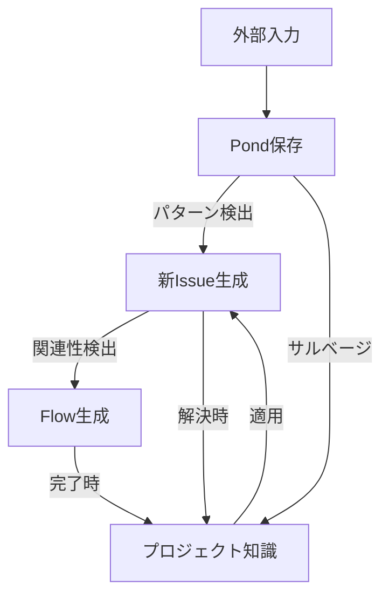

# 情報モデル間の相互作用設計

## 1. 現在の定義整理

### 1.1 各モデルの役割（現状）

#### PondEntry
- **役割**: すべてのイベントとInputが保存されるベクトル化ストア

>>> すべてのイベントではなくなっています。「外部イベント」と「ユーザリクエスト」だけです。

- **特徴**:
  - 完全な履歴保存
  - ベクトル検索による意味的類似度検索
  - サルベージによる価値ある情報の発掘
- **データソース**: Reporter入力、イベント、ユーザーリクエスト

#### Issue
- **役割**: ユーザーに代わってAIが追跡・管理すべき事項
- **特徴**:
  - GitHubのIssueモデルを参考
  - ユーザーの認知的負荷を肩代わりする単位
  - 状態管理（open/closed）
  - 関係性管理（blocks, relates_to, duplicates, parent_of）

#### Flow
- **役割**: 複数のIssueをまとめた、より大きな作業単位
- **特徴**:
  - 11種類の詳細なステータス
  - AIによる動的な優先度評価（0.0～1.0）
  - Issue群の集約管理

#### Knowledge
- **役割**: 多様な情報源から抽出・蒸留された永続的な知識
- **特徴**:
  - 5種類の知識タイプ
  - 評価システム（upvotes/downvotes）
  - 複数の情報源から構成可能

## 2. 不明瞭な点と課題

### 2.1 概念的な曖昧さ

#### Pond vs その他のモデル
- **現状の問題**:
  - Pondは「すべてを保存する」が、他のモデルとの境界が不明確

>>> 「外部から与えられたものすべて」と定義されました

  - IssueやKnowledgeもPondに保存されるのか？
  - Pondからのサルベージと他モデルへの変換の基準が不明

>>> 基本的にはknowledgeにしか変化しない方向で考えています。Issue化はユーザの指示によって行えるはずです

#### Issue vs Flow
- **現状の問題**:
  - Issueの粒度の定義が曖昧
    - >>> かなり幅があることを想定しています。時間軸、情報量ともに多様でありえます。
  - いつIssueを作り、いつFlowにまとめるのか
    - >>> 「Flowにまとめる」ことはありません。Flowによって「位置づけられる」だけです
  - FlowなしでIssueだけで管理することは可能か？
    - >>> FlowなしのIssueはありえます。
  - Flowの自動生成基準が不明
    - >>> Flowは「観点」をもち、その観点に基づいて集められたIssueに位置づけを与えます。Issueはリストされますが、関係性については自然言語的に文章で定義されます。
    - >>> つまり、「観点」が必要になった場合に発生します。これはある程度決め打ちでシステムが用意するのもありだと思っていて、「今週の作業」「今日のタスク」「スタックしている作業」のような一定のルールに基づいて生成される想定です
    - >>> ユーザのリクエストに応じて作るのも１つの方法で、最初はこれだけで良いと思います。「観点」を与えて、Issueを収集するところからスタートします。

#### Knowledge の成長と管理
- **現状の問題**:
  - 既存Knowledgeの更新 vs 新規作成の判断基準
    - >>> 受動的な更新と能動的な更新がありえます。能動的な更新は内容が古くなった時にイベントを発生させて、内容の更新を試みる方法
    - >>> 受動的な更新は、新規のknowledgeが生成された時に、その内容をマージする方法。
    - >>> 抽出されたKnowledgeについては新規作成だけで良いかもしれません。「純度が高い」ですから。
  - 知識の陳腐化をどう検出するか
    - >>> 最終更新時間、downvotes、あるいはラベル付け
    - >>> KnowledgeCorrupptedみたいなイベントを発行するのは手かも
  - 信頼度スコアの実際の活用方法
    - >>> downvotesが一定以下に下がったとき、更新か破棄（アーカイブ？）を決めます
    - >>> upvotesは検索順位に含めましょう
  - 矛盾する知識の扱い
    - >>> イベント日付の不一致などがあれば、ユーザに問い合わせるのも手だと思います
    - >>> ユーザへの問い合わせに関する方法も検討が必要ですね。
    - >>> 基本的にはIssueを立てて、ユーザからの応答が得られたら処理してクローズかな。

### 2.2 ライフサイクルの不明確さ

#### データの流れ
- **不明な点**:
  1. Input → Pond → Issue の変換タイミング
    - >>> コードが存在するはずです。inputの発生直後にpondに保存、イベントが発生してIssueが生成される可能性があります。
  2. Issue → Knowledge の抽出条件
    - >>> Issueがクローズした場合にチェックを発生させる形が実装されているはずです。実装を確認
  3. Flow の生成・完了・アーカイブ条件
    - 生成については「観点」が提供されたとき。その際に完了条件を決めます。全関連Issueのクローズは１つの基準になり得ます
  4. Pond からの定期的なサルベージの仕組み
    - サルベージの方法についてのレシピを別途定義するという話にしていたはず。「〜月のイベント情報」みたいな集め方ですね

#### 状態遷移
- **不明な点**:
  - Issue: open → closed の判定基準
    - >>> 生成AIに任せています。簡単なプロンプとしかないので、起票時に終了条件を設けるような指示を付けるべきかもしれません
  - Flow: 11種類のステータス間の遷移ルール
    - >>> 11種類のステータスが適切か不明ですね。基本的には生成AIにお任せでプロンプト次第です
  - Knowledge: 信頼度による自動削除や更新
    - >>> 更新・アーカイブは行います。downvotesが役に立つでしょう。

### 2.3 相互作用パターンの未定義

#### 双方向の関係
- Issue ↔ Flow: IssueがFlowを変更できるか？
  - >>> Issueの更新はイベントとしてFlowの更新を引き起こします。
  - >>> FlowがIssueを直接触ることは想定していませんが、Flowが記述するIssueの関係性は更新されます（Issueには影響しない）
- Issue ↔ Knowledge: Knowledgeから新しいIssueが生まれるか？
  - >>> 生まれません
- Pond ↔ Knowledge: Knowledgeは再度Pondに戻るか？
  - >>> 戻りません

#### トリガーと連鎖
- 一つのモデルの変更が他にどう影響するか
- カスケード更新のルール
- 循環参照の防止

## 3. 設計方針の提案

### 3.1 階層構造の明確化

```
┌─────────────────────────────────────────┐
│                  Flow                    │ ← 戦略層（長期的な作業単位）
├─────────────────────────────────────────┤
│                 Issue                    │ ← 戦術層（追跡可能な事項）
├─────────────────────────────────────────┤
│               Knowledge                  │ ← 知識層（蒸留された情報）
├─────────────────────────────────────────┤
│                 Pond                     │ ← 記録層（すべての生データ）
└─────────────────────────────────────────┘
```

### 3.2 役割の再定義（提案）

#### Pond
- **新定義**: 「情報の海」- すべての生データと処理履歴の不変ストア
- **責務**:
  - 完全性: データの欠落なし
  - 不変性: 一度保存されたら変更不可
  - 探索性: ベクトル検索で意味的な発見を支援
- **含まれるもの**:
  - 外部からの入力（Reporter経由）
  - システムイベント
  - ユーザーリクエスト
  - 処理ログ
- **含まれないもの**: Issue、Flow、Knowledgeの構造化データ本体

#### Issue
- **新定義**: 「追跡すべき具体的な事項」- アクション可能な単位
- **責務**:
  - 明確性: 何をすべきかが明確
  - 追跡性: 進捗と状態が管理される
  - 関連性: 他のIssueとの関係を保持
- **生成基準**:
  - ユーザーの明示的な要求
  - パターン検出による自動生成
  - Knowledgeからの派生

#### Flow
- **新定義**: 「目的を持った作業の流れ」- 複数Issueの調整単位
- **責務**:
  - 統合性: 関連するIssueをグループ化
  - 優先度: 全体最適の観点から優先度を管理
  - 進捗管理: マイルストーン的な管理
- **自動生成トリガー**:
  - 3つ以上の関連Issueが検出された時
  - ユーザーが明示的にプロジェクトを定義した時
  - 定期的なクラスタリング分析

#### Knowledge
- **新定義**: 「再利用可能な知恵」- 検証された情報の結晶
- **責務**:
  - 永続性: 長期的に価値を持つ
  - 信頼性: 評価システムによる品質管理
  - 適用性: 新しい状況に適用可能
- **抽出基準**:
  - Issueが解決された時の学び
  - パターンの繰り返し検出
  - ユーザーの明示的な知識化要求

## 4. 相互作用ルール（提案）

### 4.1 基本的な流れ



### 4.2 トリガールール

#### Pond → Issue
- トリガー: パターン検出、閾値超過、ユーザー指示
- 条件: 類似エントリが3つ以上、重要度スコア0.7以上

#### Issue → Flow
- トリガー: 関連Issue数 ≥ 3、ユーザー指示
- 条件: 共通ラベル、相互参照、時間的近接性

#### Issue → Knowledge
- トリガー: Issue closed、定期的な振り返り
- 条件: 解決に至った、学びがある、再現性がある

#### Pond → Knowledge（直接）
- トリガー: 定期サルベージ（日次/週次）
- 条件: 頻出パターン、高スコアクラスター

### 4.3 状態管理ルール

#### Issue状態遷移
```
open → closed:
  - ユーザー確認
  - 自動判定（関連Flow完了、期限経過、重複検出）

closed → open:
  - 再発検出
  - ユーザー指示
```

#### Flow状態遷移
```
backlog → active: 優先度上昇、依存解消
active → blocked: 依存Issue未解決
active → completed: 全Issue完了
completed → archived: 30日経過
```

## 5. 次のステップ

1. この設計案についてレビューと議論
2. 各モデルの詳細仕様書作成
3. ワークフローとの統合設計
4. 実装への反映計画

## 6. 未解決の課題

- Knowledgeの自動更新vs新規作成の具体的アルゴリズム
- Flowの自動分割・統合の基準
- Pondのアーカイブ戦略（容量管理）
- 各モデル間の整合性チェック機構