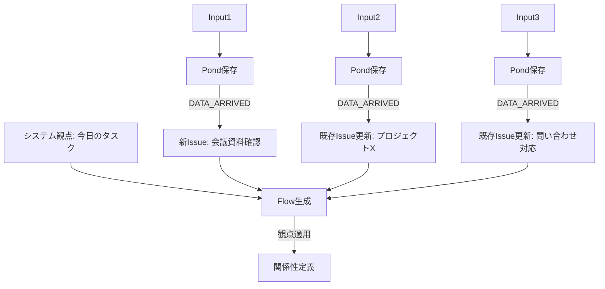

# Phase 4 ユースケース・シナリオ集

## 概要

Phase 4の情報モデル設計（Input/Pond/Issue/Flow/Knowledge）に基づいた具体的なユースケースを定義します。各シナリオで、インプット・アウトプット・状態変化を明確にし、成功・失敗パターンを検討します。

## シナリオ1: 朝のメール処理とタスク整理

### 概要
朝、複数のメールが届いている状況で、システムが自動的にIssueを作成・更新し、「今日のタスク」Flowを生成する。

### インプット
```typescript
// 3通のメールがReporterから到着
Input1: {
  source: "gmail",
  content: "【重要】明日の会議資料を確認してください",
  metadata: { sender: "boss@company.com", importance: "high" }
}

Input2: {
  source: "gmail",
  content: "プロジェクトXの進捗確認: 現在70%完了",
  metadata: { sender: "team@company.com" }
}

Input3: {
  source: "gmail",
  content: "Re: 先週の問い合わせの件",
  metadata: { sender: "client@example.com", thread_id: "thread-123" }
}
```

### 処理フロー



### アウトプット

```typescript
// 生成されたFlow
Flow: {
  id: "flow-daily-20240930",
  title: "今日のタスク - 2024/09/30",
  perspective: {
    type: "system",
    name: "daily_tasks"
  },
  issueIds: ["issue-001", "issue-002", "issue-003"],
  relationships: `
    1. 会議資料確認（高優先度）を最初に対応
    2. その後、問い合わせ対応（顧客対応のため午前中に）
    3. プロジェクトX進捗は午後に確認
    優先度: issue-001 > issue-003 > issue-002
  `,
  priorityScore: 0.8,
  completionCriteria: "3つのIssueすべてが本日中に対応完了"
}
```

### 成功パターン
- ✅ 関連メールを正しくグルーピング（thread_idによる）
- ✅ 優先度を適切に判断（senderとimportanceから）
- ✅ 既存Issueとの関連付け成功

### 失敗リスクと対策
- ❌ **リスク**: 同じ内容のメールを重複Issue化
  - **対策**: 類似度スコア0.8以上は既存Issue更新と判定
- ❌ **リスク**: 優先度判断ミス
  - **対策**: ユーザーフィードバックで学習

## シナリオ2: プロジェクトの長期管理

### 概要
ユーザーが「プロジェクトX」という観点を定義し、関連するIssueを自動収集・管理する。

### インプット
```typescript
// ユーザーリクエスト
UserRequest: {
  content: "プロジェクトXの全体像を把握したい。関連するタスクをまとめて管理して",
  userId: "user-001"
}
```

### 処理フロー

1. **観点の定義**
```typescript
UserPerspective: {
  title: "プロジェクトX",
  description: "ECサイトリニューアルプロジェクト",
  query: "label:project-x OR content:~'ECサイト' OR content:~'リニューアル'",
  completionCriteria: "全機能実装とテスト完了"
}
```

2. **Issue収集**
```typescript
// Pondとexisting Issuesから関連データを収集
SearchResults: {
  fromPond: [
    { content: "ECサイトのデザイン案", score: 0.9 },
    { content: "決済システムの仕様", score: 0.85 }
  ],
  existingIssues: [
    { id: "issue-101", title: "トップページデザイン" },
    { id: "issue-102", title: "カート機能実装" },
    { id: "issue-103", title: "決済API統合" }
  ]
}
```

3. **Flow生成と関係性定義**
```typescript
Flow: {
  id: "flow-project-x",
  title: "プロジェクトX",
  perspective: UserPerspective,
  issueIds: ["issue-101", "issue-102", "issue-103"],
  relationships: `
    フェーズ1: デザイン
    - issue-101: トップページデザイン（完了予定: 10/5）

    フェーズ2: 実装
    - issue-102: カート機能（依存: issue-101）
    - issue-103: 決済API統合（並行作業可能）

    クリティカルパス: issue-101 → issue-102
    見積もり期間: 3週間
  `,
  priorityScore: 0.9,
  status: "active"
}
```

### アウトプット
- 構造化されたプロジェクトビュー
- 依存関係の可視化
- 進捗トラッキングの基盤

### 成功パターン
- ✅ 散在していた情報を一元管理
- ✅ 依存関係の自動検出
- ✅ クリティカルパスの特定

### 失敗リスクと対策
- ❌ **リスク**: 無関係なIssueを含めてしまう
  - **対策**: 類似度閾値の調整、ユーザー確認フロー
- ❌ **リスク**: 依存関係の誤認識
  - **対策**: 明示的な依存関係指定オプション

## シナリオ3: 矛盾検出と解決

### 概要
同じ案件について矛盾する情報が入力された場合の処理。

### インプット
```typescript
Input1: {
  content: "会議は10月1日の14:00から",
  source: "slack"
}

Input2: {
  content: "会議は10月1日の15:00に変更",
  source: "email"
}
```

### 処理フロー

1. **矛盾検出**
```typescript
ContradictionDetected: {
  type: "CONTRADICTION_DETECTED",
  payload: {
    items: [
      { id: "input-1", content: "14:00から", source: "slack" },
      { id: "input-2", content: "15:00に変更", source: "email" }
    ],
    conflictType: "time_conflict"
  }
}
```

2. **問い合わせIssue作成**
```typescript
InquiryIssue: {
  id: "issue-inquiry-001",
  title: "会議時間の確認が必要",
  type: "contradiction",
  description: "異なる時間情報があります：14:00（Slack）vs 15:00（Email）",
  status: "open",
  labels: ["要確認", "矛盾"]
}
```

3. **ユーザー応答処理**
```typescript
UserResponse: {
  issueId: "issue-inquiry-001",
  response: "15:00が正しい",
  action: "update_related"
}
```

### アウトプット
- 正しい情報でIssue更新
- 矛盾したKnowledgeの更新/アーカイブ
- 信頼度スコアの調整

### 成功パターン
- ✅ 矛盾の早期発見
- ✅ ユーザー確認による正確性向上
- ✅ 学習による将来の矛盾防止

### 失敗リスクと対策
- ❌ **リスク**: 矛盾の見逃し
  - **対策**: キーワードベースの追加チェック
- ❌ **リスク**: 過剰な問い合わせ
  - **対策**: 信頼度による自動判定の導入

## シナリオ4: Knowledge抽出とサルベージ

### 概要
完了したIssueからの知識抽出と、Pondからの定期サルベージ。

### インプット
```typescript
// 完了したIssue
ClosedIssue: {
  id: "issue-200",
  title: "顧客クレーム対応",
  description: "配送遅延に関するクレーム",
  resolution: "返金と次回割引クーポン発行で解決",
  updates: [
    { content: "顧客に連絡", timestamp: "2024-09-28T10:00:00Z" },
    { content: "上司承認取得", timestamp: "2024-09-28T11:00:00Z" },
    { content: "対応完了", timestamp: "2024-09-28T15:00:00Z" }
  ]
}
```

### 処理フロー

1. **Knowledge抽出**
```typescript
ExtractedKnowledge: {
  id: "knowledge-001",
  type: "process_manual",
  content: `
    配送遅延クレーム対応手順:
    1. 顧客への迅速な連絡（24時間以内）
    2. 上司承認の取得
    3. 返金または割引クーポンの提供
    4. フォローアップの実施
  `,
  sources: [{ type: "issue", issueId: "issue-200" }],
  reputation: { upvotes: 0, downvotes: 0 }
}
```

2. **Pondサルベージ（月次）**
```typescript
SalvageRecipe: {
  name: "月次クレーム分析",
  query: {
    dateRange: "last_month",
    pattern: "クレーム|苦情|complaint",
    source: ["email", "slack"]
  },
  result: {
    patterns: [
      "配送遅延が全体の40%",
      "金曜日に集中する傾向"
    ],
    suggestedKnowledge: {
      type: "curated_summary",
      content: "9月のクレーム傾向：配送関連が最多、金曜日要注意"
    }
  }
}
```

### アウトプット
- プロセスマニュアルの自動生成
- 傾向分析レポート
- 改善提案の基礎データ

### 成功パターン
- ✅ 暗黙知の形式知化
- ✅ パターンの自動発見
- ✅ 継続的な改善サイクル

### 失敗リスクと対策
- ❌ **リスク**: 誤った一般化
  - **対策**: 複数事例での検証
- ❌ **リスク**: 古い知識の陳腐化
  - **対策**: 定期的な有効性チェック

## まとめ

### 設計の強み
1. **自動化**: Input → Issue → Flow の自動処理
2. **柔軟性**: ユーザー定義の観点によるカスタマイズ
3. **学習**: Knowledge蓄積による継続的改善
4. **信頼性**: 矛盾検出とユーザー確認メカニズム

### 改善が必要な領域
1. **Flow自動生成の精度**: より賢い関係性理解
2. **Knowledge品質管理**: 陳腐化の自動検出
3. **スケーラビリティ**: 大量データ時のパフォーマンス
4. **ユーザー負荷**: 問い合わせの最適化