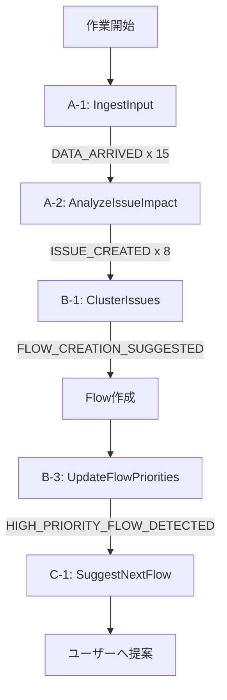
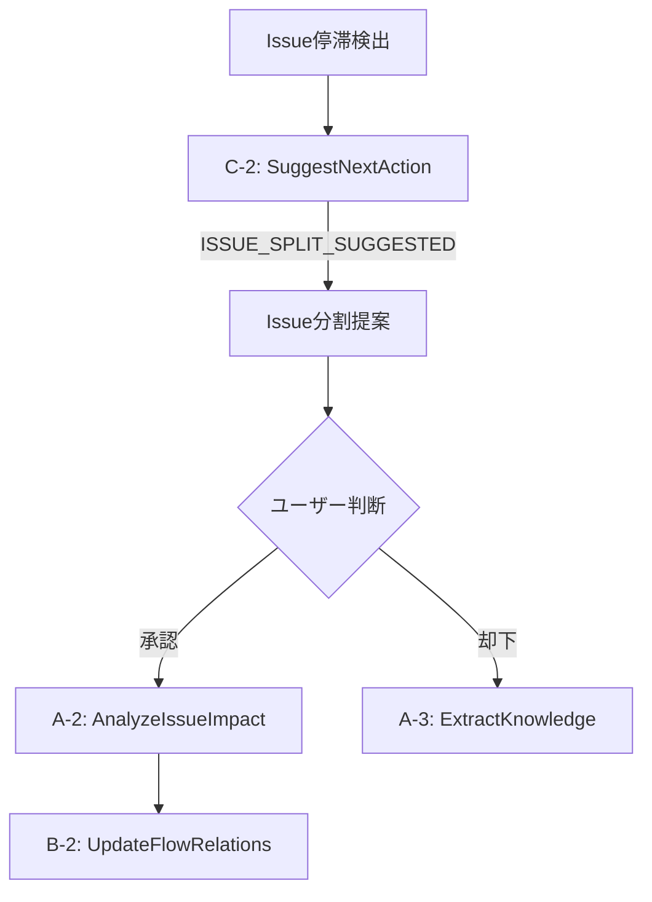
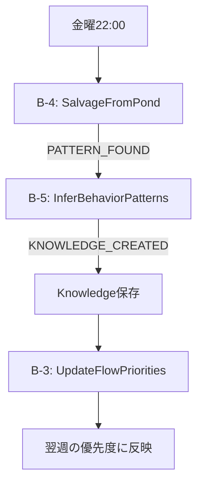
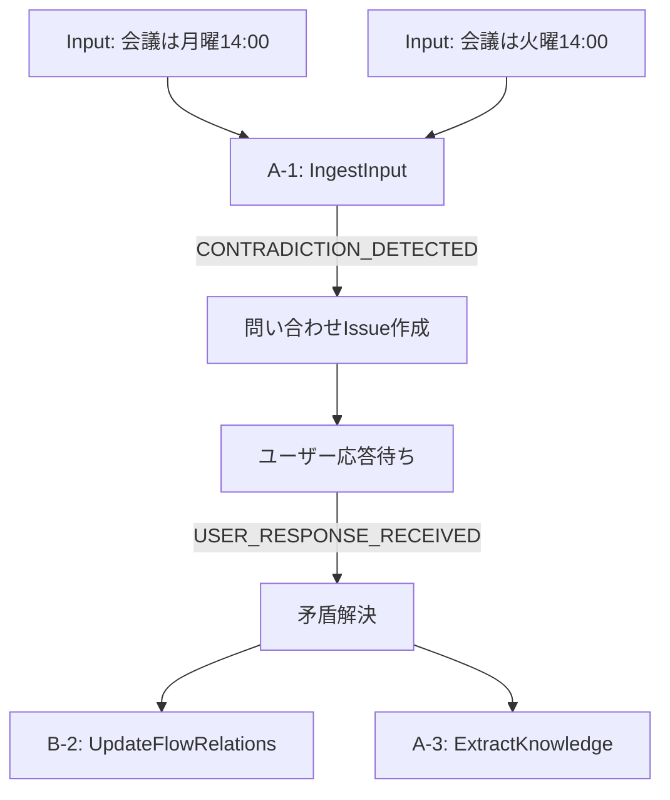

# ワークフロー統合シナリオ

## 概要

B系・C系ワークフローがどのように連携し、ユーザーの作業を支援するかを具体的なシナリオで示します。

## シナリオ1: 朝の作業開始フロー

### 状況
月曜日の朝9時、ユーザーが作業を開始する。週末にメールやSlackメッセージが蓄積している。

### ワークフロー実行順序



### 詳細フロー

#### 1. データ取り込み（A-1）
```typescript
// 15件のInputが到着
Inputs: [
  { source: 'gmail', content: '【緊急】プロジェクトX仕様変更' },
  { source: 'gmail', content: 'Re: 金曜日の会議について' },
  { source: 'slack', content: '@user バグ報告: ログイン画面でエラー' },
  // ... 他12件
]
```

#### 2. Issue作成と影響分析（A-2）
```typescript
// 8件の新規Issue作成
CreatedIssues: [
  { id: 'issue-501', title: 'プロジェクトX仕様変更対応', priority: 85 },
  { id: 'issue-502', title: 'ログイン画面バグ修正', priority: 75 },
  { id: 'issue-503', title: '会議準備', priority: 60 },
  // ... 他5件
]
```

#### 3. クラスタリング（B-1）
```typescript
// B-1が実行され、3つのクラスタを発見
Clusters: [
  {
    perspective: {
      type: 'project',
      title: 'プロジェクトX関連',
      description: '仕様変更と関連タスク'
    },
    issueIds: ['issue-501', 'issue-504', 'issue-507'],
    relationships: `
      - issue-501: 仕様変更の確認と影響評価（最優先）
      - issue-504: 設計書の更新
      - issue-507: テストケースの見直し
      依存関係: issue-501 → issue-504 → issue-507
    `
  },
  {
    perspective: {
      type: 'temporal',
      title: '今日の緊急対応',
      description: '即座に対応が必要な項目'
    },
    issueIds: ['issue-502', 'issue-505'],
    relationships: `
      - issue-502: ログインバグ（顧客影響あり）
      - issue-505: データベース接続エラー
      両方とも独立して対応可能、並行作業推奨
    `
  },
  {
    perspective: {
      type: 'thematic',
      title: '会議・コミュニケーション',
      description: '会議準備と連絡事項'
    },
    issueIds: ['issue-503', 'issue-506', 'issue-508'],
    relationships: `
      - issue-503: 金曜日の会議準備
      - issue-506: 議事録作成
      - issue-508: 参加者への連絡
      順序: issue-508 → issue-503 → issue-506
    `
  }
]
```

#### 4. Flow作成と優先度設定（B-3）
```typescript
// 3つのFlowが自動作成され、優先度が設定される
CreatedFlows: [
  {
    id: 'flow-201',
    title: '今日の緊急対応',
    priorityScore: 0.95,  // 最高優先度
    urgencyLevel: 'critical'
  },
  {
    id: 'flow-202',
    title: 'プロジェクトX関連',
    priorityScore: 0.75,
    urgencyLevel: 'high'
  },
  {
    id: 'flow-203',
    title: '会議・コミュニケーション',
    priorityScore: 0.45,
    urgencyLevel: 'normal'
  }
]
```

#### 5. 次のFlow提案（C-1）
```typescript
// C-1が最適なFlowを提案
Suggestion: {
  primarySuggestion: {
    flow: 'flow-201',  // 今日の緊急対応
    reason: '顧客影響のあるバグが含まれており、即座の対応が必要です',
    estimatedDuration: 90,
    preparationSteps: [
      'ローカル環境でバグを再現',
      '関連するログを収集',
      'テスト環境へのアクセス確認'
    ]
  },
  alternatives: [
    {
      flow: 'flow-202',
      reason: '仕様変更は重要ですが、午後から着手でも間に合います'
    }
  ],
  insights: {
    currentFocus: '技術的な問題解決が最優先',
    productivityAdvice: '午前中のエネルギーが高い時間帯に複雑なバグ修正を完了させましょう'
  }
}
```

## シナリオ2: Issue停滞の検出と解決支援

### 状況
あるIssueが3日間更新されておらず、停滞している。

### ワークフロー実行順序



### 詳細フロー

#### 1. アクション提案（C-2）
```typescript
// 停滞しているIssueに対してC-2が実行
StalledIssue: {
  id: 'issue-301',
  title: 'レポート機能の全面改修',
  stalledDuration: 72, // hours
  description: '月次レポートの生成機能を新しいフレームワークで書き直す'
}

// C-2の分析結果
ActionSuggestion: {
  rootCauseAnalysis: {
    identified: true,
    description: 'タスクが大きすぎて着手点が不明確',
    evidence: ['更新履歴なし', '関連コメントで「どこから始めれば...」']
  },
  splitSuggestion: {
    shouldSplit: true,
    reason: 'タスクを小さく分割することで着手しやすくなります',
    suggestedSubIssues: [
      {
        title: '現行レポート機能の仕様調査',
        description: '既存の機能と出力を文書化',
        dependency: 'independent'
      },
      {
        title: '新フレームワークのPOC作成',
        description: '最小限の機能でプロトタイプ作成',
        dependency: 'independent'
      },
      {
        title: 'データマイグレーション計画',
        description: '既存データの移行方法を検討',
        dependency: 'sequential'
      }
    ]
  }
}
```

#### 2. Issue分割と再構成
```typescript
// ユーザーが分割を承認した場合
SplitResult: {
  originalIssue: 'issue-301',
  newIssues: [
    { id: 'issue-301-1', title: '現行レポート機能の仕様調査', priority: 60 },
    { id: 'issue-301-2', title: '新フレームワークのPOC作成', priority: 70 },
    { id: 'issue-301-3', title: 'データマイグレーション計画', priority: 50 }
  ]
}

// B-2が実行され、Flow関係性を更新
FlowUpdate: {
  flowId: 'flow-101',
  oldRelationships: 'issue-301: レポート機能改修（停滞中）',
  newRelationships: `
    レポート機能改修（分割済み）:
    1. issue-301-1: 仕様調査（2日以内）
    2. issue-301-2: POC作成（並行実施可能）
    3. issue-301-3: マイグレーション計画（1, 2完了後）
    推定完了: 1週間（元の見積もり: 不明）
  `
}
```

## シナリオ3: 週次サルベージとパターン発見

### 状況
毎週金曜日の夜に、Pondのサルベージが実行される。

### ワークフロー実行順序



### 詳細フロー

#### 1. Pondサルベージ（B-4）
```typescript
// 週次サルベージレシピ
SalvageRecipe: {
  name: '週次振り返り',
  schedule: 'weekly',
  query: {
    dateRange: 'last_week',
    source: ['slack', 'email', 'calendar']
  }
}

// サルベージ結果
SalvageResult: {
  patterns: [
    {
      type: 'recurring',
      description: '木曜日に緊急タスクが集中する傾向',
      frequency: 0.8,  // 80%の確率
      examples: ['緊急バグ修正', 'クライアント対応', '締切前作業']
    },
    {
      type: 'correlation',
      description: '月曜朝のメール処理に平均2時間消費',
      frequency: 1.0,
      examples: ['週末の蓄積メール', '週初めの調整作業']
    }
  ],
  salvagedKnowledge: [
    {
      type: 'user_pattern',
      content: '木曜日は緊急対応用のバッファ時間を確保すべき',
      confidence: 0.85
    }
  ]
}
```

#### 2. 行動パターン推論（B-5）
```typescript
// B-5による詳細分析
BehaviorAnalysis: {
  patterns: [
    {
      type: 'bottleneck',
      description: '木曜日の割り込みタスクが金曜日の計画を崩している',
      impact: 'negative',
      suggestions: [
        '木曜日の午後は会議を入れない',
        '水曜日までに週の主要タスクを完了させる'
      ]
    },
    {
      type: 'productivity',
      description: '火曜日と水曜日の生産性が最も高い',
      impact: 'positive',
      suggestions: [
        '複雑なタスクは火・水に配置',
        'クリエイティブな作業もこの期間に'
      ]
    }
  ],
  recommendations: [
    {
      type: 'scheduling',
      description: '週の作業配分を前倒しにシフト',
      expectedBenefit: '金曜日のストレス軽減と品質向上'
    }
  ]
}
```

#### 3. 翌週への反映
```typescript
// 作成されたKnowledgeとFlow優先度への反映
CreatedKnowledge: {
  id: 'knowledge-401',
  type: 'system_rule',
  content: '木曜日は緊急対応バッファ、火水は重要タスク集中日',
  metadata: {
    autoApply: true,
    effectiveFrom: '次週月曜日'
  }
}

// B-3が翌週月曜日に実行される際、このKnowledgeを参照
PriorityAdjustment: {
  tuesday: { modifier: +0.1, reason: '高生産性期間' },
  wednesday: { modifier: +0.1, reason: '高生産性期間' },
  thursday: { modifier: -0.2, reason: '緊急対応バッファ' }
}
```

## シナリオ4: ユーザー問い合わせによる矛盾解決

### 状況
同じ会議について異なる日時情報が入力され、矛盾が検出される。

### ワークフロー実行順序



### 詳細フロー

#### 1. 矛盾検出
```typescript
// 2つの矛盾するInputs
Inputs: [
  {
    id: 'input-601',
    content: 'プロジェクトレビュー会議は月曜14:00から',
    source: 'email',
    timestamp: '2024-09-30T09:00:00Z'
  },
  {
    id: 'input-602',
    content: 'レビュー会議を火曜14:00に変更しました',
    source: 'slack',
    timestamp: '2024-09-30T10:00:00Z'
  }
]

// 矛盾検出イベント
ContradictionEvent: {
  type: 'CONTRADICTION_DETECTED',
  items: ['input-601', 'input-602'],
  conflictType: 'schedule_conflict',
  confidence: 0.9
}
```

#### 2. 問い合わせIssue作成
```typescript
InquiryIssue: {
  id: 'issue-701',
  type: 'user_inquiry',
  title: '会議日時の確認が必要',
  description: `
    プロジェクトレビュー会議の日時について矛盾する情報があります：
    1. Email (9:00): 月曜14:00
    2. Slack (10:00): 火曜14:00

    どちらが正しいですか？
  `,
  status: 'waiting_response',
  priority: 80,  // 高優先度
  metadata: {
    conflictingInputs: ['input-601', 'input-602'],
    requiresUserInput: true,
    timeout: 3600000  // 1時間
  }
}
```

#### 3. ユーザー応答と解決
```typescript
// ユーザー応答
UserResponse: {
  issueId: 'issue-701',
  response: '火曜14:00が正しいです。Slackの情報が最新です。',
  action: 'update_related'
}

// 解決処理
Resolution: {
  correctInformation: {
    meeting: 'プロジェクトレビュー',
    date: '火曜日',
    time: '14:00'
  },
  actions: [
    { type: 'update_issue', id: 'issue-403', field: 'schedule' },
    { type: 'create_knowledge', content: 'Slackの情報を優先する' }
  ]
}

// Knowledge作成（A-3）
ExtractedKnowledge: {
  type: 'decision_record',
  content: '情報源の優先順位: Slack > Email（より即時性が高いため）',
  confidence: 0.7
}
```

## ワークフロー連携マトリックス

### イベント発行と受信の関係

| 発行元 | イベント | 受信ワークフロー | 効果 |
|--------|----------|------------------|------|
| A-1 | DATA_ARRIVED | A-2 | Issue作成・更新 |
| A-2 | ISSUE_CREATED | B-1, B-2 | クラスタリング、Flow更新 |
| B-1 | FLOW_CREATION_SUGGESTED | (Flow作成) | 新規Flow生成 |
| B-1 | ISSUES_CLUSTER_DETECTED | B-2, B-3 | 関係性・優先度更新 |
| B-2 | FLOW_RELATIONS_CHANGED | B-3, C-1 | 優先度再計算、提案更新 |
| B-3 | HIGH_PRIORITY_FLOW_DETECTED | C-1 | 即座の提案生成 |
| B-4 | PATTERN_FOUND | B-5, A-3 | パターン分析、Knowledge化 |
| B-5 | KNOWLEDGE_CREATED | B-3 | 優先度ルール更新 |
| C-1 | PERSPECTIVE_TRIGGERED | B-2 | Flow観点の再評価 |
| C-2 | ISSUE_SPLIT_SUGGESTED | A-2, B-1 | Issue分割、再クラスタリング |

### 優先度による実行順序

1. **Critical (80-100)**
   - ユーザー問い合わせ対応
   - 緊急Issue対応

2. **High (60-79)**
   - A-0: ProcessUserRequest
   - ユーザーリクエスト処理

3. **Medium (40-59)**
   - A-1: IngestInput
   - データ取り込み

4. **Normal (20-39)**
   - A-2: AnalyzeIssueImpact
   - C-1, C-2: 提案生成

5. **Low (0-19)**
   - B系: 横断的分析
   - A-3: Knowledge抽出
   - B-4: サルベージ

## まとめ

### 設計の特徴

1. **イベント駆動の連鎖**
   - 各ワークフローが独立して動作
   - イベントによる疎結合な連携

2. **優先度ベースの実行**
   - ユーザー影響の高いものを優先
   - バックグラウンド処理の自動調整

3. **学習と改善**
   - パターン発見による自動最適化
   - ユーザーフィードバックの反映

4. **Flow観点システムの活用**
   - 動的な Issue グルーピング
   - 自然言語による関係性管理

### 次のステップ

1. 実装優先順位の決定
2. テストシナリオの詳細化
3. パフォーマンスベンチマークの設計
4. ユーザーインターフェース要件の明確化