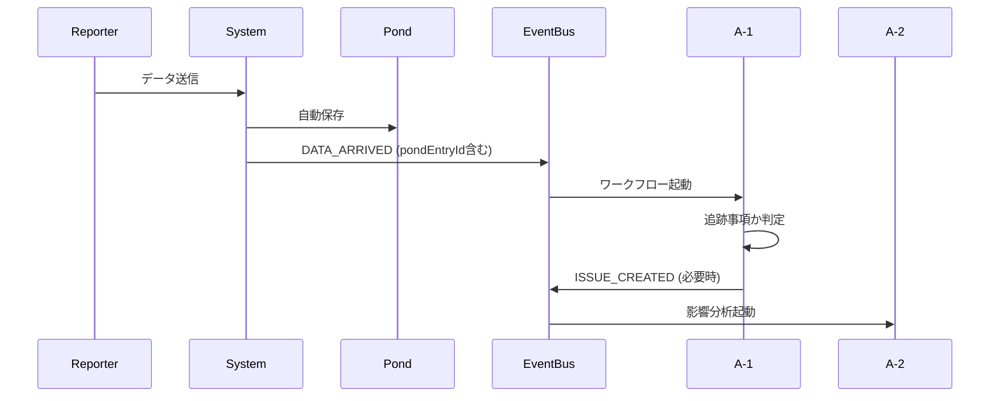
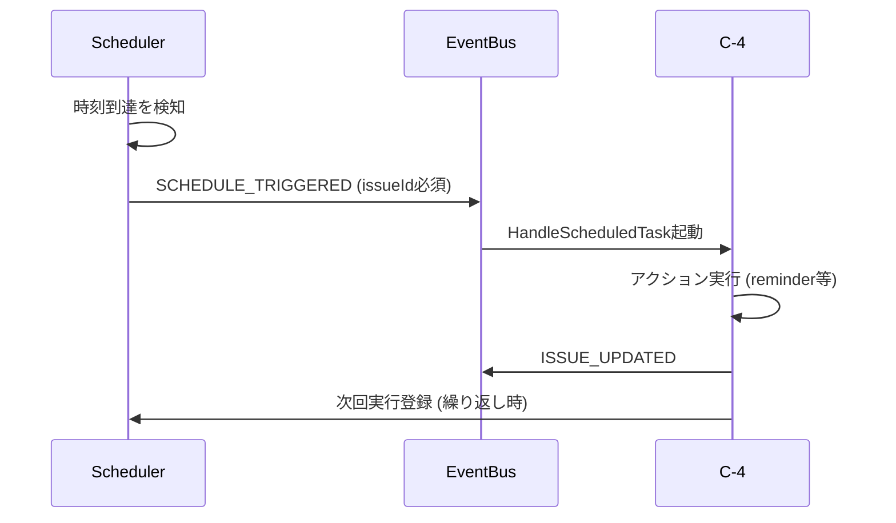
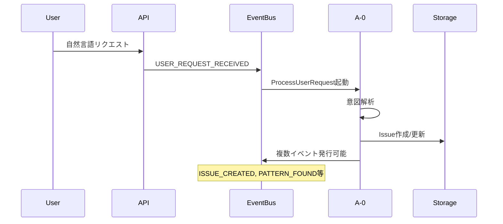
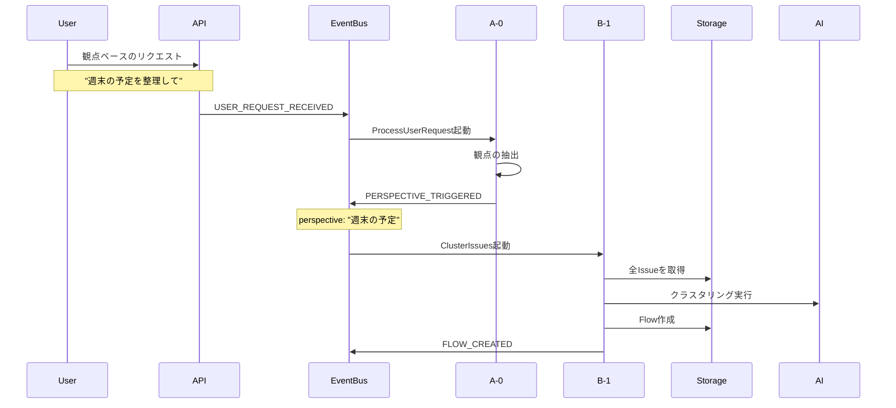

# イベントカタログ

## 1. 概要

このドキュメントは、sebas-chanシステムで定義されているすべてのイベントの正式なカタログです。イベントは「システムで起きた具体的な出来事」を表現し、ワークフローをトリガーする重要な要素です。

## 2. イベント設計原則

### 2.1 命名規則

#### 基本ルール

- **大文字スネークケース**: `USER_REQUEST_RECEIVED`
- **過去形/完了形**: 起きたことを表現（`_DETECTED`, `_CREATED`, `_UPDATED`, `_CHANGED`）
- **明確で具体的**: 何が起きたかが名前から明確

#### 主語の明確化

- **主語を必ず含める**: `ISSUE_CREATED`, `PATTERN_FOUND`, `KNOWLEDGE_EXTRACTABLE`
- **対象が曖昧な場合は詳細化**:
  - × `HIGH_PRIORITY_DETECTED` （何の高優先度？）
  - ○ `HIGH_PRIORITY_ISSUE_DETECTED` （Issueの高優先度）
  - ○ `HIGH_PRIORITY_FLOW_DETECTED` （Flowの高優先度）

#### 避けるべき命名

- **曖昧な名前**: `ERROR_DETECTED` （どんなエラー？誰の？）
- **汎用的すぎる名前**: `ANALYSIS_COMPLETE` （何の分析？）
- **システム寄りの名前**: `SYSTEM_ERROR`, `EXCEPTION_THROWN`
- **重複する名前**: `SCHEDULED_TIME_REACHED` vs `SCHEDULE_TRIGGERED`

#### payloadの設計指針

- **entityTypeより別イベント**: payload内のentityTypeで分岐するより、別イベントとして定義
- **必要最小限の情報**: ワークフローが判断に必要な情報のみを含める
- **型安全性**: TypeScriptの型定義を明確に

### 2.2 カテゴリ分類

- **外部イベント**: システム外部から発生
- **データイベント**: データの変更・追加
- **分析イベント**: 分析・処理の完了
- **システムイベント**: システム内部の状態変化

## 3. イベントフローの例

### 外部データ到着時のフロー



1. **データ到着**: Reporterから外部データが到着
2. **自動Pond保存**: システムが自動的にPondに保存
3. **イベント発行**: `DATA_ARRIVED`イベント（pondEntryIdを含む）
4. **ワークフロー起動**: A-1 (IngestInput)が起動
5. **分析・判定**: 追跡すべき事項かを判定
6. **Issue作成**: 必要に応じて`ISSUE_CREATED`イベント発行

### スケジュール実行時のフロー



1. **時刻到達**: context.schedulerに登録された時刻に到達
2. **イベント発行**: `SCHEDULE_TRIGGERED`イベント（issueId必須）
3. **ワークフロー起動**: C-4 (HandleScheduledTask)が起動
4. **アクション実行**: reminder/escalate/follow_up等を実行
5. **Issue更新**: 必要に応じて`ISSUE_UPDATED`イベント発行
6. **次回スケジュール**: 繰り返しの場合は次回実行を登録

### ユーザーリクエスト処理のフロー



1. **リクエスト受信**: ユーザーから自然言語でリクエスト
2. **イベント発行**: `USER_REQUEST_RECEIVED`イベント
3. **意図解析**: A-0が自然言語を解析
4. **動的イベント発行**: 内容に応じて適切なイベントを発行
5. **連鎖実行**: 発行されたイベントが次のワークフローをトリガー

### 観点ベースのクラスタリングフロー（A-0→B-1連携）



1. **観点ベースのリクエスト**: ユーザーが「週末の予定」「プロジェクトA」等の観点でリクエスト
2. **A-0で観点抽出**: ProcessUserRequestが自然言語から観点を理解
3. **PERSPECTIVE_TRIGGERED発行**: 観点情報を含むイベントを発行
4. **B-1でクラスタリング**: ClusterIssuesが観点に基づいてIssue群を分析
5. **Flow作成**: クラスタリング結果に基づいて新しいFlowを作成
6. **FLOW_CREATED発行**: 新しいFlowの作成を通知（将来の拡張用）

**重要な設計思想**:
- **Flow→Issueの一方向関係**: FlowがIssueを選択し、意味付けする
- **観点による意味の付与**: Flowは単なるグループではなく、Issueに新たな意味を与える視点
- **動的な関係性**: 同じIssueが複数のFlowに属することが可能（異なる観点から見られる）

## 4. イベント定義詳細

### USER_REQUEST_RECEIVED

**カテゴリ**: 外部イベント
**説明**: ユーザーから自然言語のリクエストを受信した

```typescript
interface UserRequestReceivedEvent {
  type: 'USER_REQUEST_RECEIVED';
  payload: {
    userId: string;
    content: string;
    sessionId?: string;
    timestamp: string;
    metadata?: {
      source: 'web' | 'api' | 'cli';
      ip?: string;
    };
  };
}
```

**トリガーするワークフロー**:

- A-0: ProcessUserRequest (優先度: 60)

**発生元**: Web UI, API, CLI

---

### DATA_ARRIVED

**カテゴリ**: 外部イベント
**説明**: 外部システムからデータが到着した（自動的にPondに保存される）

```typescript
interface DataArrivedEvent {
  type: 'DATA_ARRIVED';
  payload: {
    source: string; // Reporter名など
    content: string; // 生データ
    format?: string; // データ形式
    pondEntryId: string; // 保存されたPondエントリのID
    metadata?: Record<string, unknown>;
    timestamp: string;
  };
}
```

**トリガーするワークフロー**:

- A-1: IngestInput (優先度: 40)

**発生元**: Reporters, Webhooks, 外部API

**備考**: データ到着時にシステムが自動的にPondに保存し、そのIDをpayloadに含める

---

### ISSUE_CREATED

**カテゴリ**: データイベント
**説明**: 新しいIssueが作成された

```typescript
interface IssueCreatedEvent {
  type: 'ISSUE_CREATED';
  payload: {
    issueId: string;
    issue: Issue;
    createdBy: 'user' | 'system' | 'workflow';
    sourceWorkflow?: string;
  };
}
```

**トリガーするワークフロー**:

- A-2: AnalyzeIssueImpact (優先度: 30)
- B-2: UpdateFlowRelations (優先度: 15)

**発生元**: A-1: IngestInput, ユーザー操作

---

### ISSUE_UPDATED

**カテゴリ**: データイベント
**説明**: 既存のIssueが更新された

```typescript
interface IssueUpdatedEvent {
  type: 'ISSUE_UPDATED';
  payload: {
    issueId: string;
    updates: {
      before: Partial<Issue>;
      after: Partial<Issue>;
      changedFields: string[];
    };
    updatedBy: string;
  };
}
```

**トリガーするワークフロー**:

- A-2: AnalyzeIssueImpact (condition: 重要な更新のみ)
- B-3: UpdateFlowPriorities (優先度: 15)

**発生元**: 各種ワークフロー、ユーザー操作

---

### ISSUE_STATUS_CHANGED

**カテゴリ**: データイベント
**説明**: Issueのステータスが変更された

```typescript
interface IssueStatusChangedEvent {
  type: 'ISSUE_STATUS_CHANGED';
  payload: {
    issueId: string;
    from: IssueStatus;
    to: IssueStatus;
    reason?: string;
    issue: Issue;
  };
}
```

**トリガーするワークフロー**:

- A-3: ExtractKnowledge (condition: status === 'resolved')
- C-1: SuggestNextFlow (優先度: 25)

**発生元**: ワークフロー、ユーザー操作

---


### PERSPECTIVE_TRIGGERED

**カテゴリ**: 分析イベント
**説明**: ユーザーから観点ベースのリクエストが発生した

```typescript
interface PerspectiveTriggeredEvent {
  type: 'PERSPECTIVE_TRIGGERED';
  payload: {
    perspective: string; // 観点の説明（例: "週末の予定", "来週の締切"）
    requestedBy: string; // ユーザーID
    context?: string; // 追加のコンテキスト情報
    timestamp: string;
  };
}
```

**トリガーするワークフロー**:

- B-1: ClusterIssues (優先度: 10)

**発生元**: A-0: ProcessUserRequest

---

### PATTERN_FOUND

**カテゴリ**: 分析イベント
**説明**: Issue群から共通パターンが発見された

```typescript
interface PatternFoundEvent {
  type: 'PATTERN_FOUND';
  payload: {
    patternType: 'recurring' | 'temporal' | 'category' | 'dependency';
    pattern: {
      description: string;
      occurrences: number;
      confidence: number;
      examples: string[];
    };
    relatedIssues: string[];
    suggestedAction?: string;
  };
}
```

**トリガーするワークフロー**:

- A-3: ExtractKnowledge (優先度: 20)

**発生元**: B-1: ClusterIssues, B-4: SalvageFromPond

---

### KNOWLEDGE_EXTRACTABLE

**カテゴリ**: 分析イベント
**説明**: Issueから知識抽出可能な情報が特定された

```typescript
interface KnowledgeExtractableEvent {
  type: 'KNOWLEDGE_EXTRACTABLE';
  payload: {
    sourceType: 'issue' | 'pattern' | 'resolution' | 'feedback';
    sourceId: string;
    confidence: number;
    reason: string;
    suggestedCategory?: KnowledgeCategory;
  };
}
```

**トリガーするワークフロー**:

- A-3: ExtractKnowledge (優先度: 20)

**発生元**: A-2: AnalyzeIssueImpact

---

### KNOWLEDGE_CREATED

**カテゴリ**: データイベント
**説明**: 新しい知識が作成された

```typescript
interface KnowledgeCreatedEvent {
  type: 'KNOWLEDGE_CREATED';
  payload: {
    knowledgeId: string;
    knowledge: Knowledge;
    sourceWorkflow: string;
    extractedFrom: {
      type: string;
      id: string;
    };
  };
}
```

**トリガーするワークフロー**:

- なし（終端イベント）

**発生元**: A-3: ExtractKnowledge

---

### FLOW_CREATED

**カテゴリ**: データイベント
**説明**: 新しいFlowが作成された

```typescript
interface FlowCreatedEvent {
  type: 'FLOW_CREATED';
  payload: {
    flowId: string;
    flow: Flow;
    createdBy: 'user' | 'system' | 'workflow';
    sourceWorkflow?: string;
    perspective?: string; // Flowの観点（クラスタリングの基準）
  };
}
```

**トリガーするワークフロー**:

- （将来実装予定: 優先度調整、計画見直し等）

**発生元**: B-1: ClusterIssues

**備考**: 現在は終端イベントだが、将来的に優先度調整や計画見直しのワークフローが購読する可能性がある

---

### HIGH_PRIORITY_ISSUE_DETECTED

**カテゴリ**: 分析イベント
**説明**: 高優先度のIssueが検出された

```typescript
interface HighPriorityIssueDetectedEvent {
  type: 'HIGH_PRIORITY_ISSUE_DETECTED';
  payload: {
    issueId: string;
    priority: number; // 80-100
    reason: string;
    requiredAction?: string;
  };
}
```

**トリガーするワークフロー**:

- C-2: SuggestNextAction (優先度: 25)
- 通知システム（将来実装）

**発生元**: A-2: AnalyzeIssueImpact

---

### HIGH_PRIORITY_FLOW_DETECTED

**カテゴリ**: 分析イベント
**説明**: 高優先度のFlowが検出された

```typescript
interface HighPriorityFlowDetectedEvent {
  type: 'HIGH_PRIORITY_FLOW_DETECTED';
  payload: {
    flowId: string;
    priority: number; // 80-100
    reason: string;
    requiredAction?: string;
  };
}
```

**トリガーするワークフロー**:

- C-2: SuggestNextAction (優先度: 25)
- 通知システム（将来実装）

**発生元**: B-3: UpdateFlowPriorities

---

### SCHEDULE_TRIGGERED

**カテゴリ**: システムイベント
**説明**: context.schedulerに登録されたスケジュールが実行時刻に達した

**備考**: context.schedulerはWorkflowContextInterfaceで提供されるスケジュール管理機能です。
すべてのスケジュールは必ずIssueに紐付き、自然言語での時刻指定（「3日後の朝9時」等）を
ModulerPromptで解釈して絶対時刻に変換します。

```typescript
interface ScheduleTriggeredEvent {
  type: 'SCHEDULE_TRIGGERED';
  payload: {
    issueId: string; // 関連Issue（必須）
    scheduleId: string; // スケジュールID
    action: ScheduleAction; // 実行するアクション
    originalRequest: string; // 元の自然言語リクエスト
    metadata?: {
      occurrences: number; // 実行回数
      nextRun?: string; // 次回実行時刻（繰り返しの場合）
    };
  };
}

type ScheduleAction =
  | 'reminder' // リマインダー通知
  | 'escalate' // エスカレーション
  | 'auto_close' // 自動クローズ
  | 'follow_up' // フォローアップ
  | 'check_progress'; // 進捗確認
```

**トリガーするワークフロー**:

- C-4: HandleScheduledTask (優先度: 35)

**発生元**: WorkflowScheduler（システムコンポーネント）

**備考**:

- すべてのスケジュールは必ずIssueに紐付く
- Issue closeでスケジュールも自動キャンセルされる
- 自然言語での時刻指定をModulerPromptで解釈

---


## 4. イベント発行マトリクス

| ワークフロー             | 発行するイベント                                                   |
| ------------------------ | ------------------------------------------------------------------ |
| システム（データ受信時） | `DATA_ARRIVED` (Pond保存済み)                                      |
| A-0: ProcessUserRequest  | `PERSPECTIVE_TRIGGERED`, (動的: ユーザーリクエストに応じて各種イベント) |
| A-1: IngestInput         | `PATTERN_FOUND`, `ISSUE_CREATED`                                   |
| A-2: AnalyzeIssueImpact  | `KNOWLEDGE_EXTRACTABLE`, `HIGH_PRIORITY_ISSUE_DETECTED`, `ISSUE_UPDATED` |
| A-3: ExtractKnowledge    | `KNOWLEDGE_CREATED`                                                |
| B-1: ClusterIssues       | `FLOW_CREATED`, `PATTERN_FOUND` (クラスタリング結果)               |
| B-4: SalvageFromPond     | `PATTERN_FOUND`, `KNOWLEDGE_EXTRACTABLE`                           |

## 5. イベント購読マトリクス

| イベント                 | 購読するワークフロー | 条件                 |
| ------------------------ | -------------------- | -------------------- |
| `USER_REQUEST_RECEIVED`  | A-0                  | 常に                 |
| `DATA_ARRIVED`           | A-1                  | 常に                 |
| `ISSUE_CREATED`          | A-2, B-2             | 常に                 |
| `ISSUE_UPDATED`          | A-2                  | 重要な更新のみ       |
| `KNOWLEDGE_EXTRACTABLE`  | A-3                  | 常に                 |
| `HIGH_PRIORITY_ISSUE_DETECTED` | C-2           | 常に                 |
| `HIGH_PRIORITY_FLOW_DETECTED`  | C-2           | 常に                 |
| `PERSPECTIVE_TRIGGERED`  | B-1                  | 常に                 |
| `PATTERN_FOUND`          | A-3                  | パターンタイプによる |

## 6. イベント実装ガイドライン

### 6.1 新しいイベントを追加する場合

1. **必要性の確認**: 既存のイベントで表現できないか検討
2. **命名規則の遵守**:
   - 主語を明確にする（ISSUE_、KNOWLEDGE_、FLOW_など）
   - 過去形・完了形を使用（_CREATED、_UPDATED、_DETECTED）
   - システム寄りの名前を避ける（ERROR、EXCEPTION等）
3. **payload設計**:
   - entityTypeではなく別イベントで分離
   - 必要十分な情報のみを含める
   - TypeScript型定義を明確に
4. **ドキュメント**: このカタログに追加

### 6.2 イベント発行のベストプラクティス

```typescript
// 良い例: 主語が明確で、具体的な条件でイベント発行
if (issue.priority > 80 && !issue.acknowledged) {
  emitter.emit({
    type: 'HIGH_PRIORITY_ISSUE_DETECTED',  // 主語: ISSUE
    payload: {
      issueId: issue.id,
      priority: issue.priority,
      reason: 'Unacknowledged high priority issue',
      requiredAction: 'Immediate attention required',
    },
  });
}

// 悪い例1: 主語が不明確
emitter.emit({
  type: 'ERROR_DETECTED',  // 何のエラー？
  payload: { message: 'Something went wrong' },
});

// 悪い例2: entityTypeで分岐
emitter.emit({
  type: 'HIGH_PRIORITY_DETECTED',
  payload: {
    entityType: 'issue',  // これは別イベントにすべき
    entityId: issue.id,
  },
});
```

### 6.3 イベント購読のベストプラクティス

```typescript
// 良い例: 具体的な条件で購読
const workflow: WorkflowDefinition = {
  name: 'ProcessHighPriorityIssue',
  triggers: {
    eventTypes: ['ISSUE_CREATED', 'ISSUE_UPDATED'],
    condition: (event) => {
      const issue = event.payload.issue;
      return issue && issue.priority > 80;
    },
    priority: 50,
  },
  executor: processHighPriority,
};
```

## 7. 設計の簡潔性

### イベント統合の原則

- **データ到着 = Pond保存**: `DATA_ARRIVED`イベントは、Pond保存が完了した状態を表す
- **独立イベントの最小化**: 自明な処理（Pond保存など）は独立イベントにしない
- **ワークフローの単純化**: 1つのイベントを1つのワークフローが処理することを基本とする

## 8. 今後の拡張

### 計画中のイベント

- `FLOW_CREATED`: 新しいFlowが作成された
- `FLOW_COMPLETED`: Flowが完了した
- `USER_FEEDBACK_RECEIVED`: ユーザーフィードバックを受信
- `SYSTEM_HEALTH_CHANGED`: システムヘルス状態が変化
- `THRESHOLD_EXCEEDED`: 閾値を超過した

## 9. まとめ

イベントはsebas-chanシステムの神経系です。明確に定義され、文書化されたイベントにより：

1. **予測可能性**: どのような出来事が起きるかが明確
2. **追跡可能性**: イベントの流れを追跡可能
3. **拡張性**: 新しいワークフローの追加が容易
4. **保守性**: イベントとワークフローの関係が明確

このカタログは、システムの成長とともに継続的に更新される必要があります。
