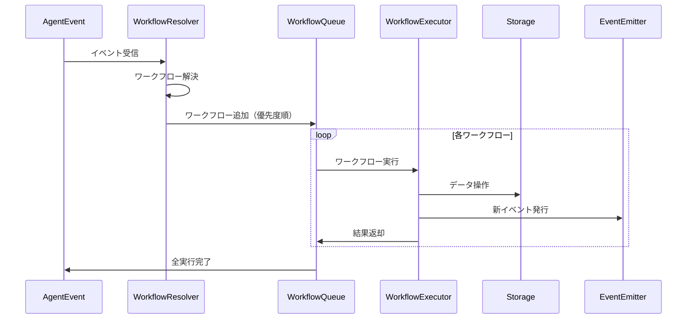

# ワークフロー技術仕様書

## 1. 概要

sebas-chanのワークフローシステムは、イベント駆動型の関数ベースアーキテクチャを採用しています。各ワークフローは独立した純粋関数として実装され、トリガー条件に基づいて自動的に実行されます。

### 1.1 設計原則

- **関数ベース**: 各ワークフローは状態を持たない純粋関数
- **イベント駆動**: AgentEventによってトリガーされる
- **1対多マッピング**: 1つのイベントで複数のワークフローが実行可能
- **優先度制御**: 実行順序を優先度で制御
- **型安全**: TypeScriptの型システムで完全に型付け
- **テスタブル**: 依存注入によりモック化が容易

## 2. コアインターフェース

### 2.1 WorkflowDefinition

ワークフローの完全な定義を表現するインターフェース。

```typescript
interface WorkflowDefinition {
  /** ワークフロー名（ユニーク識別子） */
  name: string;

  /** ワークフローの説明 */
  description: string;

  /** トリガー条件 */
  triggers: WorkflowTrigger;

  /** 実行関数 */
  executor: WorkflowExecutor;
}
```

#### フィールド仕様

| フィールド | 型 | 必須 | 説明 |
|-----------|-----|------|------|
| `name` | `string` | ✓ | ワークフローのユニーク識別子。英数字とハイフン、アンダースコアのみ使用可能 |
| `description` | `string` | ✓ | ワークフローの目的と動作の説明（最大500文字推奨） |
| `triggers` | `WorkflowTrigger` | ✓ | ワークフローの実行条件を定義 |
| `executor` | `WorkflowExecutor` | ✓ | 実際の処理を実行する関数 |

### 2.2 WorkflowTrigger

ワークフローがいつ実行されるかを定義するインターフェース。

```typescript
interface WorkflowTrigger {
  /** 反応するイベントタイプのリスト */
  eventTypes: string[];

  /** 追加の実行条件（オプション） */
  condition?: (event: AgentEvent) => boolean;

  /** 実行優先度（大きいほど優先、デフォルト: 0） */
  priority?: number;

  /** スケジュール実行（オプション、将来実装） */
  schedule?: {
    cron?: string;  // Cron式
    interval?: number;  // ミリ秒単位
  };
}
```

#### フィールド仕様

| フィールド | 型 | 必須 | デフォルト | 説明 |
|-----------|-----|------|------------|------|
| `eventTypes` | `string[]` | ✓ | - | トリガーとなるイベントタイプのリスト。空配列は不可 |
| `condition` | `Function` | - | - | イベントタイプに加えて評価される追加条件 |
| `priority` | `number` | - | `0` | 実行優先度。範囲: -100 〜 100 |

#### 優先度システム

- **高優先度 (50-100)**: システムクリティカルな処理
- **標準優先度 (0-49)**: 通常の業務処理
- **低優先度 (-100--1)**: バックグラウンド処理、分析処理

### 2.3 WorkflowExecutor

ワークフローの実行関数の型定義。

```typescript
type WorkflowExecutor = (
  event: AgentEvent,
  context: WorkflowContextInterface,
  emitter: WorkflowEventEmitterInterface
) => Promise<WorkflowResult>;
```

#### パラメータ仕様

| パラメータ | 型 | 説明 |
|-----------|-----|------|
| `event` | `AgentEvent` | トリガーとなったイベント |
| `context` | `WorkflowContextInterface` | 実行環境へのアクセス |
| `emitter` | `WorkflowEventEmitterInterface` | 新しいイベントの発行 |

#### 戻り値

`Promise<WorkflowResult>` - 実行結果を含むPromise

### 2.4 WorkflowResult

ワークフロー実行の結果を表現するインターフェース。

```typescript
interface WorkflowResult {
  /** 実行の成功/失敗 */
  success: boolean;

  /** 実行後のコンテキスト状態 */
  context: WorkflowContextInterface;

  /** 実行結果のデータ（オプション） */
  output?: unknown;

  /** エラー情報（失敗時） */
  error?: Error;
}
```

#### フィールド仕様

| フィールド | 型 | 必須 | 説明 |
|-----------|-----|------|------|
| `success` | `boolean` | ✓ | true: 正常終了、false: エラー終了 |
| `context` | `WorkflowContextInterface` | ✓ | 実行後のコンテキスト（変更されていない場合も含む） |
| `output` | `unknown` | - | ワークフロー固有の出力データ |
| `error` | `Error` | - | エラーオブジェクト（success=falseの場合は必須） |

## 3. WorkflowContext

ワークフローが実行される環境を提供するインターフェース。

### 3.1 WorkflowContextInterface

```typescript
interface WorkflowContextInterface {
  /** 現在のシステム状態 */
  state: string;

  /** データストレージへのアクセス */
  storage: WorkflowStorageInterface;

  /** AIドライバーファクトリ */
  createDriver: DriverFactory;

  /** ワークフローロガー */
  logger: WorkflowLogger;

  /** 実行時設定 */
  config?: WorkflowConfig;

  /** 実行時メタデータ */
  metadata?: Record<string, unknown>;
}
```

### 3.2 WorkflowStorageInterface

データベース操作のための統一インターフェース。

```typescript
interface WorkflowStorageInterface {
  // Issue操作
  getIssue(id: string): Promise<Issue | null>;
  searchIssues(query: string): Promise<Issue[]>;
  createIssue(issue: Omit<Issue, 'id' | 'createdAt' | 'updatedAt'>): Promise<Issue>;
  updateIssue(id: string, update: Partial<Issue>): Promise<Issue>;

  // Pond操作
  searchPond(query: string): Promise<PondEntry[]>;
  addPondEntry(entry: Omit<PondEntry, 'id' | 'timestamp'>): Promise<PondEntry>;

  // Knowledge操作
  getKnowledge(id: string): Promise<Knowledge | null>;
  searchKnowledge(query: string): Promise<Knowledge[]>;
  createKnowledge(knowledge: Omit<Knowledge, 'id' | 'createdAt'>): Promise<Knowledge>;
  updateKnowledge(id: string, update: Partial<Knowledge>): Promise<Knowledge>;
}
```

### 3.3 WorkflowEventEmitterInterface

次のワークフローをトリガーするためのイベント発行インターフェース。

```typescript
interface WorkflowEventEmitterInterface {
  emit(event: {
    type: WorkflowEventType;
    payload: unknown;
  }): void;
}
```

## 4. エラーハンドリング

### 4.1 エラー種別

| エラー種別 | 説明 | リトライ可能 |
|-----------|------|--------------|
| `ValidationError` | 入力検証エラー | ✗ |
| `TimeoutError` | タイムアウト | ✓ |
| `NetworkError` | ネットワークエラー | ✓ |
| `StorageError` | データベースエラー | ✓ |
| `AIDriverError` | AI処理エラー | ✓ |
| `WorkflowError` | ワークフロー実行エラー | ✗ |

### 4.2 エラー処理戦略

```typescript
interface ErrorHandlingStrategy {
  /** リトライ可能なエラーか判定 */
  isRetryable(error: Error): boolean;

  /** 最大リトライ回数 */
  maxRetries: number;

  /** リトライ間隔（ミリ秒） */
  retryDelay: number;

  /** エクスポネンシャルバックオフを使用 */
  useExponentialBackoff: boolean;
}
```

### 4.3 デフォルト戦略

- **リトライ可能エラー**: 最大3回、初回1秒後、指数バックオフ
- **リトライ不可エラー**: 即座に失敗を返す
- **タイムアウト**: ワークフロー全体で30秒

## 5. ワークフロー実装要件

### 5.1 必須要件

1. **純粋関数性**: 副作用はcontext.storageとemitterのみを通じて実行
2. **エラーハンドリング**: すべての例外をキャッチしWorkflowResultで返す
3. **ログ記録**: 検証可能性を確保しつつ最小限のログに留める
4. **タイムアウト**: 長時間実行される処理は適切にタイムアウトを設定

### 5.2 推奨事項

1. **単一責任**: 1つのワークフローは1つの明確な目的を持つ
2. **テスト可能性**: 依存関係はすべてcontextから注入
3. **ドキュメント**: JSDocで入出力と動作を明記
4. **型安全性**: anyの使用を避け、明確な型定義を使用

## 6. ワークフロー解決（Resolution）

### 6.1 WorkflowResolution

イベントに対してマッチするワークフローを解決した結果。

```typescript
interface WorkflowResolution {
  /** マッチしたワークフロー（優先度順） */
  workflows: WorkflowDefinition[];
}
```

### 6.2 解決プロセス

1. **イベントタイプマッチング**: `eventTypes`配列との照合
2. **条件評価**: `condition`関数の実行（存在する場合）
3. **優先度ソート**: `priority`の降順でソート
4. **実行リスト生成**: WorkflowDefinitionの配列を返す

## 7. 実行フロー



## 8. パフォーマンス要件

| 項目 | 要件 | 備考 |
|------|------|------|
| ワークフロー解決時間 | < 10ms | 100個のワークフローでの測定値 |
| 単一ワークフロー実行時間 | < 5秒 | AI処理を除く |
| 同時実行数 | 最大10 | システムリソースに依存 |
| メモリ使用量 | < 100MB/ワークフロー | 通常の処理時 |

## 9. セキュリティ考慮事項

1. **入力検証**: すべての外部入力は検証する
2. **権限チェック**: 操作権限を適切に確認
3. **ログサニタイズ**: 機密情報をログに含めない
4. **タイムアウト**: DoS攻撃を防ぐため適切に設定

## 10. 今後の拡張予定

- **ワークフローバージョニング**: 複数バージョンの並行実行
- **条件付き分岐**: ワークフロー内での条件分岐
- **並列実行**: 複数ワークフローの並列処理
- **ワークフローチェーン**: 明示的な連鎖実行
- **メトリクス収集**: 実行時間、成功率などの統計