# ワークフロー技術仕様書

## 1. 概要

sebas-chanのワークフローシステムは、イベント駆動型の関数ベースアーキテクチャを採用しています。各ワークフローは独立した純粋関数として実装され、トリガー条件に基づいて自動的に実行されます。

### 1.1 設計原則

- **関数ベース**: 各ワークフローは状態を持たない純粋関数
- **イベント駆動**: AgentEventによってトリガーされる
- **1対多マッピング**: 1つのイベントで複数のワークフローが実行可能
- **優先度制御**: 実行順序を優先度で制御
- **型安全**: TypeScriptの型システムで完全に型付け
- **テスタブル**: 依存注入によりモック化が容易

## 2. コアインターフェース

### 2.1 WorkflowDefinition

ワークフローの完全な定義を表現するインターフェース。

```typescript
interface WorkflowDefinition {
  /** ワークフロー名（ユニーク識別子） */
  name: string;

  /** ワークフローの説明 */
  description: string;

  /** トリガー条件 */
  triggers: WorkflowTrigger;

  /** 実行関数 */
  executor: WorkflowExecutor;
}
```

#### フィールド仕様

| フィールド    | 型                 | 必須 | 説明                                                                       |
| ------------- | ------------------ | ---- | -------------------------------------------------------------------------- |
| `name`        | `string`           | ✓    | ワークフローのユニーク識別子。英数字とハイフン、アンダースコアのみ使用可能 |
| `description` | `string`           | ✓    | ワークフローの目的と動作の説明（最大500文字推奨）                          |
| `triggers`    | `WorkflowTrigger`  | ✓    | ワークフローの実行条件を定義                                               |
| `executor`    | `WorkflowExecutor` | ✓    | 実際の処理を実行する関数                                                   |

### 2.2 WorkflowTrigger

ワークフローがいつ実行されるかを定義するインターフェース。

```typescript
interface WorkflowTrigger {
  /** 反応するイベントタイプのリスト */
  eventTypes: string[];

  /** 追加の実行条件（オプション） */
  condition?: (event: AgentEvent) => boolean;

  /** 実行優先度（大きいほど優先、デフォルト: 0） */
  priority?: number;

  /** スケジュール実行（オプション、将来実装） */
  schedule?: {
    cron?: string; // Cron式
    interval?: number; // ミリ秒単位
  };
}
```

#### フィールド仕様

| フィールド   | 型         | 必須 | デフォルト | 説明                                               |
| ------------ | ---------- | ---- | ---------- | -------------------------------------------------- |
| `eventTypes` | `string[]` | ✓    | -          | トリガーとなるイベントタイプのリスト。空配列は不可 |
| `condition`  | `Function` | -    | -          | イベントタイプに加えて評価される追加条件           |
| `priority`   | `number`   | -    | `0`        | 実行優先度。範囲: -100 〜 100                      |

#### 優先度システム

- **高優先度 (50-100)**: システムクリティカルな処理
- **標準優先度 (0-49)**: 通常の業務処理
- **低優先度 (-100--1)**: バックグラウンド処理、分析処理

### 2.3 WorkflowExecutor

ワークフローの実行関数の型定義。

```typescript
type WorkflowExecutor = (
  event: AgentEvent,
  context: WorkflowContextInterface,
  emitter: WorkflowEventEmitterInterface
) => Promise<WorkflowResult>;
```

#### パラメータ仕様

| パラメータ | 型                              | 説明                     |
| ---------- | ------------------------------- | ------------------------ |
| `event`    | `AgentEvent`                    | トリガーとなったイベント |
| `context`  | `WorkflowContextInterface`      | 実行環境へのアクセス     |
| `emitter`  | `WorkflowEventEmitterInterface` | 新しいイベントの発行     |

#### 戻り値

`Promise<WorkflowResult>` - 実行結果を含むPromise

### 2.4 WorkflowResult

ワークフロー実行の結果を表現するインターフェース。

```typescript
interface WorkflowResult {
  /** 実行の成功/失敗 */
  success: boolean;

  /** 実行後のコンテキスト状態 */
  context: WorkflowContextInterface;

  /** 実行結果のデータ（オプション） */
  output?: unknown;

  /** エラー情報（失敗時） */
  error?: Error;
}
```

#### フィールド仕様

| フィールド | 型                         | 必須 | 説明                                               |
| ---------- | -------------------------- | ---- | -------------------------------------------------- |
| `success`  | `boolean`                  | ✓    | true: 正常終了、false: エラー終了                  |
| `context`  | `WorkflowContextInterface` | ✓    | 実行後のコンテキスト（変更されていない場合も含む） |
| `output`   | `unknown`                  | -    | ワークフロー固有の出力データ                       |
| `error`    | `Error`                    | -    | エラーオブジェクト（success=falseの場合は必須）    |

## 3. WorkflowContext

ワークフローが実行される環境を提供するインターフェース。詳細は[ワークフローから見える世界](./WORKFLOW_PERSPECTIVE.md)を参照。

### 3.1 WorkflowContextInterface

```typescript
interface WorkflowContextInterface {
  /** 現在のシステム状態 */
  state: string;

  /** データストレージへのアクセス */
  storage: WorkflowStorageInterface;

  /** AIドライバーファクトリ */
  createDriver: DriverFactory;

  /** ワークフローレコーダー */
  recorder: WorkflowRecorder;

  /** 実行時設定 */
  config?: WorkflowConfig;

  /** 実行時メタデータ */
  metadata?: Record<string, unknown>;
}
```

### 3.2 WorkflowStorageInterface

データベース操作のための統一インターフェース。

```typescript
interface WorkflowStorageInterface {
  // Issue操作 - ユーザーに代わってAIが追跡・管理すべき事項
  getIssue(id: string): Promise<Issue | null>;
  searchIssues(query: string): Promise<Issue[]>;
  createIssue(issue: Omit<Issue, 'id' | 'createdAt' | 'updatedAt'>): Promise<Issue>;
  updateIssue(id: string, update: Partial<Issue>): Promise<Issue>;

  // Pond操作 - 生データの永続化とベクトル検索
  searchPond(query: string): Promise<PondEntry[]>;
  addPondEntry(entry: Omit<PondEntry, 'id' | 'timestamp'>): Promise<PondEntry>;

  // Knowledge操作 - 再利用可能な知識の管理
  getKnowledge(id: string): Promise<Knowledge | null>;
  searchKnowledge(query: string): Promise<Knowledge[]>;
  createKnowledge(knowledge: Omit<Knowledge, 'id' | 'createdAt'>): Promise<Knowledge>;
  updateKnowledge(id: string, update: Partial<Knowledge>): Promise<Knowledge>;
}
```

#### 活用パターン

```typescript
// 関連する追跡事項の効率的な検索
const relatedIssues = await context.storage.searchIssues(
  `${issue.title} OR (${issue.labels.join(' OR ')})`
);

// Pondからのパターン発見（繰り返し現れる追跡すべき事項）
const similarEntries = await context.storage.searchPond(userInput);
if (similarEntries.length > THRESHOLD) {
  // 繰り返しパターンとして認識し、ユーザーが気づくべき傾向として記録
}

// 知識の信頼度更新
await context.storage.updateKnowledge(knowledgeId, {
  reputation: {
    upvotes: knowledge.reputation.upvotes + 1,
    downvotes: knowledge.reputation.downvotes,
  },
});
```

### 3.3 WorkflowEventEmitterInterface

次のワークフローをトリガーするためのイベント発行インターフェース。

```typescript
interface WorkflowEventEmitterInterface {
  emit(event: { type: WorkflowEventType; payload: unknown }): void;
}
```

### 3.4 WorkflowSchedulerInterface

Issueに関連付けられたスケジュール実行を管理するインターフェース。

```typescript
interface WorkflowSchedulerInterface {
  /**
   * Issue関連のスケジュールを作成
   * 自然言語をModulerPromptで解釈して絶対時刻（ISO8601）に変換
   */
  schedule(
    issueId: string,
    request: string,
    action: ScheduleAction,
    options?: ScheduleOptions
  ): Promise<ScheduleResult>;

  /**
   * スケジュールをキャンセル
   */
  cancel(scheduleId: string): Promise<boolean>;

  /**
   * Issue関連のスケジュール一覧を取得
   */
  listByIssue(issueId: string): Promise<Schedule[]>;

  /**
   * Issue関連の全スケジュールをキャンセル
   * Issue closeと連動して自動実行される
   */
  cancelByIssue(issueId: string): Promise<void>;
}
```

#### スケジューラーの設計原則

1. **Issue必須**: すべてのスケジュールは必ずIssueに紐付く
2. **ライフサイクル連動**: Issue closeでスケジュールも自動キャンセル
3. **自然言語処理**: ModulerPromptで「3日後の朝9時」等を絶対時刻に変換
4. **永続化**: LanceDBでスケジュール情報を永続化
5. **自動復旧**: システム再起動時に未実行スケジュールを自動復元

#### アクション種別（ScheduleAction）

```typescript
type ScheduleAction =
  | 'reminder' // リマインダー通知
  | 'escalate' // エスカレーション
  | 'auto_close' // 自動クローズ
  | 'follow_up' // フォローアップ
  | 'check_progress'; // 進捗確認
```

#### 使用例

```typescript
// ワークフロー内でのスケジュール登録
const result = await context.scheduler.schedule(issue.id, '3日後の朝9時にリマインド', 'reminder', {
  timezone: 'Asia/Tokyo',
});

// 重複防止（Issue ID + dedupeKeyの組み合わせでユニーク判定）
await context.scheduler.schedule(issue.id, '毎日午後3時に進捗確認', 'check_progress', {
  dedupeKey: 'daily-check', // 同じIssue内でのみユニーク
  maxOccurrences: 7,
});
// 注: 異なるIssueでは同じdedupeKeyを使用可能

// Issue close時の自動キャンセル
await context.scheduler.cancelByIssue(issue.id);
```

#### スケジュール実行時のイベント

```typescript
interface ScheduleTriggeredEvent {
  type: 'SCHEDULE_TRIGGERED';
  payload: {
    issueId: string;
    scheduleId: string;
    action: ScheduleAction;
    originalRequest: string;
    metadata?: {
      occurrences: number;
      nextRun?: string;
    };
  };
}
```

## 4. エラーハンドリング

### 4.1 エラー種別

| エラー種別        | 説明                   | リトライ可能 |
| ----------------- | ---------------------- | ------------ |
| `ValidationError` | 入力検証エラー         | ✗            |
| `TimeoutError`    | タイムアウト           | ✓            |
| `NetworkError`    | ネットワークエラー     | ✓            |
| `StorageError`    | データベースエラー     | ✓            |
| `AIDriverError`   | AI処理エラー           | ✓            |
| `WorkflowError`   | ワークフロー実行エラー | ✗            |

### 4.2 エラー処理戦略

```typescript
interface ErrorHandlingStrategy {
  /** リトライ可能なエラーか判定 */
  isRetryable(error: Error): boolean;

  /** 最大リトライ回数 */
  maxRetries: number;

  /** リトライ間隔（ミリ秒） */
  retryDelay: number;

  /** エクスポネンシャルバックオフを使用 */
  useExponentialBackoff: boolean;
}
```

### 4.3 デフォルト戦略

- **リトライ可能エラー**: 最大3回、初回1秒後、指数バックオフ
- **リトライ不可エラー**: 即座に失敗を返す
- **タイムアウト**: ワークフロー全体で30秒

## 5. ワークフロー実装要件

### 5.1 必須要件

1. **純粋関数性**: 副作用はcontext.storageとemitterのみを通じて実行
2. **エラーハンドリング**: すべての例外をキャッチしWorkflowResultで返す
3. **ログ記録**: 検証可能性を確保しつつ最小限のログに留める
4. **タイムアウト**: 長時間実行される処理は適切にタイムアウトを設定

### 5.2 推奨事項

1. **単一責任**: 1つのワークフローは1つの明確な目的を持つ
2. **テスト可能性**: 依存関係はすべてcontextから注入
3. **ドキュメント**: JSDocで入出力と動作を明記
4. **型安全性**: anyの使用を避け、明確な型定義を使用

## 6. ワークフロー解決（Resolution）

### 6.1 WorkflowResolution

イベントに対してマッチするワークフローを解決した結果。

```typescript
interface WorkflowResolution {
  /** マッチしたワークフロー（優先度順） */
  workflows: WorkflowDefinition[];
}
```

### 6.2 解決プロセス

1. **イベントタイプマッチング**: `eventTypes`配列との照合
2. **条件評価**: `condition`関数の実行（存在する場合）
3. **優先度ソート**: `priority`の降順でソート
4. **実行リスト生成**: WorkflowDefinitionの配列を返す

## 7. イベント設計

### 7.1 イベントの多態性

payloadとconditionを活用して、シンプルなイベント構成を実現します。

```typescript
// 単一のイベントタイプで複数の意味を表現
interface DataEvent extends AgentEvent {
  type: 'DATA_CHANGED';
  payload:
    | { entity: 'issue'; action: 'created'; data: Issue }
    | { entity: 'issue'; action: 'updated'; data: IssueUpdate }
    | { entity: 'knowledge'; action: 'created'; data: Knowledge }
    | { entity: 'pond'; action: 'added'; data: PondEntry };
}

// ワークフローは特定のパターンのみに反応
const issueAnalysisWorkflow: WorkflowDefinition = {
  name: 'AnalyzeNewIssue',
  triggers: {
    eventTypes: ['DATA_CHANGED'],
    condition: (event) => {
      const payload = event.payload as any;
      return payload.entity === 'issue' && payload.action === 'created';
    },
    priority: 30,
  },
  executor: analyzeIssue,
};
```

### 7.2 データSchemaに基づくイベント

データモデルの変更が自然にイベントを生成します。

```typescript
// Issue更新時の自動イベント生成
async function updateIssueWithEvents(
  storage: WorkflowStorageInterface,
  emitter: WorkflowEventEmitterInterface,
  issueId: string,
  update: IssueUpdate
): Promise<void> {
  const before = await storage.getIssue(issueId);
  const after = await storage.updateIssue(issueId, { updates: [...before.updates, update] });

  // 状態変化に基づいてイベントを発行
  if (before.status !== after.status) {
    emitter.emit({
      type: 'ISSUE_STATUS_CHANGED',
      payload: {
        issueId,
        from: before.status,
        to: after.status,
        issue: after,
      },
    });
  }

  // 優先度変化
  if (before.priority !== after.priority && after.priority > 80) {
    emitter.emit({
      type: 'HIGH_PRIORITY_DETECTED',
      payload: { issueId, priority: after.priority },
    });
  }
}
```

### 7.3 シンプルなイベント構成の原則

1. **汎用イベントタイプ**: 細かすぎるイベントタイプを避ける
2. **payload での差別化**: 詳細はpayloadで表現
3. **condition での絞り込み**: ワークフロー側で必要な条件を定義

```typescript
// 推奨: シンプルなイベントタイプ
const RECOMMENDED_EVENT_TYPES = [
  'DATA_CHANGED', // データの変更全般
  'USER_ACTION', // ユーザーからのアクション
  'SYSTEM_EVENT', // システムイベント
  'ANALYSIS_COMPLETE', // 分析処理の完了
  'ERROR_OCCURRED', // エラー発生
];

// 非推奨: 細かすぎるイベントタイプ
const NOT_RECOMMENDED = [
  'ISSUE_CREATED_WITH_HIGH_PRIORITY_AND_ERROR_LABEL',
  'KNOWLEDGE_UPDATED_WITH_UPVOTE_FROM_ADMIN_USER',
];
```

## 8. 実行フロー

```mermaid
sequenceDiagram
    participant Event as AgentEvent
    participant Resolver as WorkflowResolver
    participant Queue as WorkflowQueue
    participant Executor as WorkflowExecutor
    participant Storage as Storage
    participant Emitter as EventEmitter

    Event->>Resolver: イベント受信
    Resolver->>Resolver: ワークフロー解決
    Resolver->>Queue: ワークフロー追加（優先度順）

    loop 各ワークフロー
        Queue->>Executor: ワークフロー実行
        Executor->>Storage: データ操作
        Executor->>Emitter: 新イベント発行
        Executor->>Queue: 結果返却
    end

    Queue->>Event: 全実行完了
```



## 9. パフォーマンス要件

| 項目                     | 要件                 | 備考                          |
| ------------------------ | -------------------- | ----------------------------- |
| ワークフロー解決時間     | < 10ms               | 100個のワークフローでの測定値 |
| 単一ワークフロー実行時間 | < 5秒                | AI処理を除く                  |
| 同時実行数               | 最大10               | システムリソースに依存        |
| メモリ使用量             | < 100MB/ワークフロー | 通常の処理時                  |

## 10. セキュリティ考慮事項

1. **入力検証**: すべての外部入力は検証する
2. **権限チェック**: 操作権限を適切に確認
3. **ログサニタイズ**: 機密情報をログに含めない
4. **タイムアウト**: DoS攻撃を防ぐため適切に設定

## 11. 今後の拡張予定

- **ワークフローバージョニング**: 複数バージョンの並行実行
- **条件付き分岐**: ワークフロー内での条件分岐
- **並列実行**: 複数ワークフローの並列処理
- **ワークフローチェーン**: 明示的な連鎖実行
- **メトリクス収集**: 実行時間、成功率などの統計

## 12. リファレンス実装

新しいワークフローを実装する際の参考として、以下のリファレンス実装を用意しています：

### A-2: ANALYZE_ISSUE_IMPACT ワークフロー

📖 **[実装ガイド](../../packages/core/src/workflows/a-2.analyze-issue-impact/README.md)**

このリファレンス実装では以下の実装パターンが確認できます：
- WorkflowDefinitionの完全な実装例
- WorkflowContextの効果的な活用方法
- WorkflowEventEmitterを使ったイベント発行
- エラーハンドリングとWorkflowResultの返却
- context.recorderによる詳細なログ記録
- テストの実装方法

## 13. 関連文書

- [ワークフローから見える世界](./WORKFLOW_PERSPECTIVE.md) - ワークフローの視点と制約
- [開発者ガイド](./DEVELOPER_GUIDE.md) - 実装ガイドライン
- [ModulerPromptガイド](./MODULER_PROMPT_GUIDE.md) - AI処理の実装
- [ロギング仕様](./LOGGING_SPEC.md) - ログ記録の仕様
